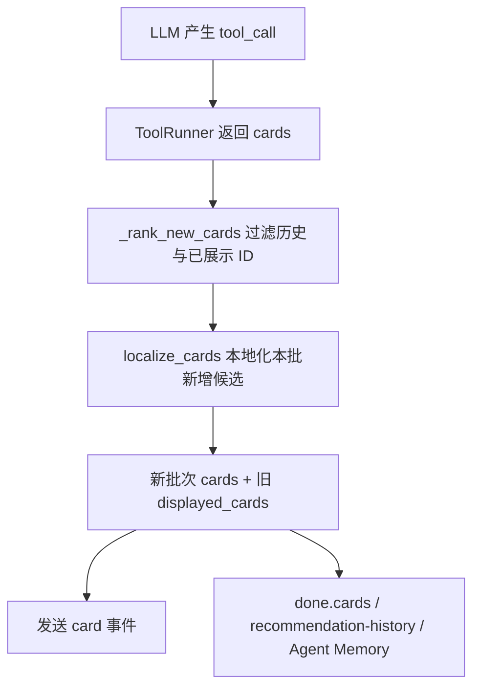

# Tool 重查结果前置设计

| 项目 | 内容 |
|------|------|
| 文档版本 | v0.1 |
| 最近更新时间 | 2026-06-14 23:46:14 CST |
| 文档状态 | 待用户确认 |
| 关联需求 | `智能食谱助手需求分析.md` v0.36 |
| 关联设计 | `智能食谱助手技术设计.md` v0.43 |
| 问题来源 | 用户反馈：Tool 结果筛选后重新查询或换方式查询得到新结果时，推荐结果列表没有把新结果放在最前面 |

## 1. 背景与根因

当前 `AgentOrchestrator` 在每次 Tool 返回卡片后，会先对本批候选执行 `rank_recommendations()`，再把去重后的新卡片追加到 `displayed_cards` 末尾。前端 `AssistantResultBlock.vue` 只按 `message.cards` 的顺序展示，并且超过 3 张时默认只展示前三张。

因此，当第一批 Tool 结果先产生旧候选，后续因为筛选、参数修正、重新查询或换 Tool 查询获得更贴近用户意图的新候选时，新候选会排在旧候选之后；默认收起态仍展示旧前三张，用户看不到最新查询结果。

## 2. 目标

1. 同一轮 Agent 内，每次 Tool 查询得到的新增可展示候选应整体排在当前推荐列表最前面。
2. 新批次内部仍沿用 `rank_recommendations()` 的排序结果，不改动现有画像、硬过滤、软降权和历史去重规则。
3. 已展示过的同 ID 卡片不重复出现。
4. `card` 流式事件、`done.cards`、推荐历史和 Agent Memory 使用同一顺序，避免前后端状态不一致。
5. 前端继续按后端返回顺序展示，不引入前端业务排序。

## 3. 非目标

1. 不改变外部 API 查询策略、Tool 参数归一化、Tool 熔断或重试预算。
2. 不把旧候选删除；旧候选保留在新候选之后，用户展开后仍可查看。
3. 不新增分页、加载更多接口或前端排序配置。
4. 不调整跨轮推荐历史的硬去重窗口。

## 4. 方案对比

| 方案 | 做法 | 优点 | 缺点 | 结论 |
|------|------|------|------|------|
| A. 后端新批次前置 | `AgentOrchestrator` 对每批 `ranked_cards` 去重后，将本批新卡片放到 `displayed_cards` 前面 | `card`、`done`、历史和 memory 顺序一致；符合“业务逻辑归后端”；改动小 | 需要补后端单元测试覆盖多批 Tool 结果 | 推荐 |
| B. 前端按 Tool 时间重排 | 前端接收 `card` 后推断新旧批次并重排 | 可局部解决展示 | 前端缺少批次语义，容易和 `done.cards` 覆盖冲突；违反前端只展示原则 | 不采用 |
| C. 新批次替换旧结果 | 新 Tool 有结果时清空旧候选 | 页面更聚焦 | 会丢失已展示候选，影响“查看更多”和推荐历史语义 | 不采用 |

## 5. 推荐设计

采用方案 A。后端在 Tool 结果形成卡片后仍执行现有 `_rank_new_cards()`，得到“本批新增候选”。随后不再 `extend` 到尾部，而是把本批新增候选放到 `displayed_cards` 前面，并保留旧候选在后面。

推荐列表顺序规则：

1. 批次内：`rank_recommendations()` 排序。
2. 批次间：最新产生新候选的批次整体在前。
3. 去重：以 `card.id` 为键，已经在 `displayed_cards` 中出现过的卡片不再次插入。
4. 本地化：仅对本批新增候选执行 `localize_cards()`，再进入列表聚合，避免重复改写旧卡片。

## 6. 数据流

## 7. 测试方案

1. 后端新增单元测试：模拟同一轮 Agent 先调用 `search_meals` 返回旧卡片，再重新查询返回新卡片，断言最后一个 `card` 事件和 `done.cards` 的顺序均为新卡片在前、旧卡片在后。
2. 后端新增重复 ID 覆盖：第二批包含已展示 ID 时不重复插入。
3. 现有前端卡片默认收起测试保持不变，用于证明前端继续展示 `cards.slice(0, 3)`，只消费后端排序。

## 8. 执行计划表

| 序号 | 任务 | 状态 | 备注 |
|------|------|------|------|
| 1 | 定位推荐卡片聚合根因 | ✅ 已完成 | 根因在 `AgentOrchestrator` 对新批次使用尾部追加 |
| 2 | 更新需求、技术设计和本设计文档 | ✅ 已完成 | 已同步 v0.36 / v0.43 / v0.1 |
| 3 | 用户确认设计 | ⏳ 待执行 | 确认后进入 TDD 实现 |
| 4 | 编写后端失败单元测试 | ⏳ 待执行 | 覆盖新批次前置与重复 ID 去重 |
| 5 | 实现最小后端聚合修复 | ⏳ 待执行 | 仅调整 `displayed_cards` 聚合方式 |
| 6 | 运行后端相关测试 | ⏳ 待执行 | 优先运行 `backend/tests/unit/test_agent_orchestrator.py` |
| 7 | 更新代码走读文档 | ⏳ 待执行 | 实现完成后同步说明 |

## 9. 成功标准

1. 同一轮多次 Tool 查询时，最新批次的新候选在推荐结果默认前三张中优先出现。
2. 旧候选没有被删除，只是排到新候选之后。
3. 重复 ID 不会在推荐结果中出现两次。
4. `card` 事件、`done.cards`、推荐历史和 Agent Memory 使用一致顺序。
5. 后端相关单元测试通过。
