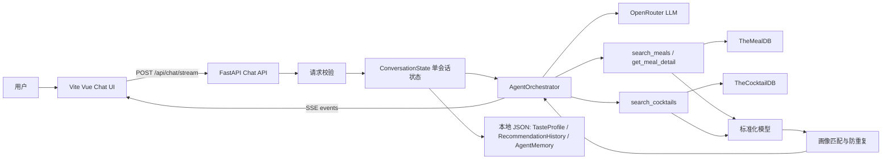

# 智能食谱助手技术设计

| 项目 | 内容 |
|------|------|
| 文档版本 | v0.8 |
| 最近更新时间 | 2026-06-14 13:40:11 CST |
| 文档状态 | 技术设计草案，待确认后进入实现计划与编码 |
| 关联需求 | `智能食谱助手需求分析.md` v0.14 |
| 技术栈 | 后端 Python FastAPI；前端 Vite + Vue 3 + TypeScript |

## 1. 设计目标

基于 `智能食谱助手需求分析.md`，本设计把智能食谱助手拆成前端 Chat UI、FastAPI 后端 Agent、外部 API 适配层、数据标准化层、轻量用户画像与推荐策略几个边界清晰的模块。

核心取舍：

1. 后端承载全部业务逻辑，包括参数校验、语言检测、Tool 调用、外部字段清洗、画像合并、推荐排序和错误降级。
2. 前端只负责交互、展示、表单体验校验和流式事件解析；用户画像、推荐历史和 Agent Memory 由后端本地 JSON 文件持久化。
3. 首版保持单用户、单 Agent、单活跃请求，不做账号、多用户、多 `session`、并发会话合并或跨设备同步。
4. 首版唯一对外 Chat 接口采用 `POST /api/chat/stream` + SSE，覆盖流式输出和消息内页签展示；不实现非流式 Chat 接口。
5. 菜品推荐使用轻量用户画像，不引入复杂推荐系统。

## 2. 技术方案选择

### 2.1 方案对比

| 方案 | 优点 | 风险 | 结论 |
|------|------|------|------|
| FastAPI + Vite Vue | Python 适合 Agent 编排；FastAPI 支持异步 HTTP 和流式响应；Vite + Vue 3 前端轻量 | 需要分别维护前后端启动脚本 | 推荐 |
| Next.js 全栈 | 前后端一体，部署简单 | Agent、HTTP 流、外部 Tool 编排都放在 Node 侧，且会引入 React 技术栈 | 不采用 |
| Node.js + Vite | 单语言栈，前端协作顺畅 | LLM 编排和后续测试生态不如 Python 直观 | 可行但不是首选 |

推荐 `FastAPI + Vite Vue 3 TypeScript`，因为本项目重心在 Agent、外部 API 清洗和后端业务编排，不是纯前端应用；前端只需要稳定承载 Chat、页签和卡片展示，Vue 3 足够轻量直接。

### 2.2 流式输出选择

| 方式 | 说明 | 结论 |
|------|------|------|
| `fetch` + `ReadableStream` 解析 SSE | 可使用 `POST` 请求体，适合携带本轮 `message` | 推荐 |
| 原生 `EventSource` | API 简洁，但主要面向 `GET` | 不采用 |
| WebSocket | 双向通信强，但首版只有请求-响应流 | 暂不采用 |

## 3. 总体架构



架构原则：

1. `api` 层只接收参数、调用服务、返回响应。
2. `service` 层处理 Agent 编排、状态流转和外部依赖组合。
3. `tool` 层定义 Agent 可调用能力，包含参数校验和标准化输出。
4. `adapter` 层只负责外部 HTTP 请求，不向上泄露请求细节。
5. `domain` 层定义标准模型、画像规则、推荐规则和语言策略。

## 4. 后端设计

### 4.1 目录结构

```text
backend/
  app/
    main.py
    api/
      chat.py
      health.py
    core/
      config.py
      errors.py
      logging.py
      sse.py
    domain/
      models.py
      normalizers.py
      language.py
      taste_profile.py
      recommendation.py
    services/
      agent_orchestrator.py
      conversation_state.py
      conversation_lock.py
      memory_store.py
      openrouter_client.py
    tools/
      meal_tool.py
      cocktail_tool.py
    adapters/
      mealdb_client.py
      cocktaildb_client.py
  tests/
    unit/
    integration/
```

### 4.2 模块职责

| 模块 | 职责 |
|------|------|
| `api/chat.py` | 暴露 Chat 流式接口；不写业务规则 |
| `core/config.py` | 读取 OpenRouter、外部 API、超时、模型名等配置 |
| `core/errors.py` | 统一业务异常、外部依赖异常和响应错误码 |
| `core/sse.py` | 统一 SSE 事件序列化 |
| `domain/models.py` | Pydantic 请求、响应、卡片、画像、Tool 轨迹模型 |
| `domain/normalizers.py` | 清洗 TheMealDB / TheCocktailDB 原始字段 |
| `domain/language.py` | 按本轮 `message` 检测输出语言 |
| `domain/taste_profile.py` | 画像合并、裁剪、去重、覆盖规则 |
| `domain/recommendation.py` | 推荐打分、防重复、主食材/分类/菜系轮换 |
| `services/agent_orchestrator.py` | Agent 主流程，连接 LLM、Tool、画像和 SSE |
| `services/conversation_state.py` | 当前唯一会话的候选卡片、消息摘要和画像状态 |
| `services/conversation_lock.py` | 单 Agent 活跃请求保护；防止两个页面同时修改同一份 memory |
| `services/memory_store.py` | 统一读写本地 JSON，恢复和持久化画像、推荐历史、Agent Memory |
| `services/openrouter_client.py` | OpenRouter 调用封装 |
| `tools/meal_tool.py` | 菜谱搜索和详情 Tool |
| `tools/cocktail_tool.py` | 饮品搜索 Tool |
| `adapters/*_client.py` | 外部 API HTTP 请求、超时、重试一次 |
| `data/taste-profile.json` | 后端本地持久化的轻量画像，作为首版画像真实来源 |
| `data/recommendation-history.json` | 后端本地持久化的推荐历史，最多保留最近 20 条 |
| `data/agent-memory.json` | 后端本地持久化的 Agent Memory，保存对话摘要、最近轮次和候选卡片引用 |

## 5. 前端设计

### 5.1 目录结构

```text
frontend/
  src/
    api/
      chat.ts
      sse.ts
    components/
      ChatPage.vue
      MessageList.vue
      MessageComposer.vue
      AssistantMessageTabs.vue
      MealCard.vue
      CocktailCard.vue
      ToolTracePanel.vue
      ProfilePanel.vue
    types/
      chat.ts
    styles/
      app.css
  tests/
```

### 5.2 前端职责

| 模块 | 职责 |
|------|------|
| `api/chat.ts` | 封装 Chat 请求和错误处理 |
| `api/sse.ts` | 解析 `meta`、`delta`、`tool_call`、`card`、`profile_update`、`done`、`error` |
| `ChatPage.vue` | 页面容器，维护消息列表和发送状态 |
| `MessageComposer.vue` | 输入框、发送按钮、空输入和长度提示 |
| `AssistantMessageTabs.vue` | 单条 Agent 消息内展示页签 |
| `MealCard.vue` | 菜谱卡片展示，不解析外部原始字段 |
| `CocktailCard.vue` | 饮品卡片展示，不解析外部原始字段 |
| `ToolTracePanel.vue` | 展示 Tool 调用链路 |
| `ProfilePanel.vue` | 展示本轮画像变化 |
前端不做：意图识别、食材翻译、推荐排序、画像合并、画像持久化、权限控制、外部 API 直连。

## 6. API 契约

### 6.1 流式接口

`POST /api/chat/stream`

请求头：

```http
Content-Type: application/json
Accept: text/event-stream
```

请求体：

```ts
type ChatStreamRequest = {
  message: string;
};
```

首版不接收 `languagePreference` 或 `locale`。输出语言由后端根据本轮 `message` 检测，并在响应事件中返回 `detectedLocale`。

### 6.2 流式降级策略

首版不实现 `POST /api/chat/message` 非流式接口。降级策略如下：

1. SSE 请求建立失败时，前端展示“连接失败，请重试”。
2. SSE 中途断开且未收到 `done` 时，前端保留已收到内容，并展示“生成中断，请重试”。
3. 不自动改走非流式接口，避免重复 Tool 调用、重复画像更新和幂等复杂度。
4. 自动化测试直接测试 `AgentOrchestrator`、Tool、领域函数和 SSE 事件解析，不依赖非流式 HTTP 接口。
5. 如果后续部署环境证明 SSE 被网关或代理缓冲，再评估新增非流式接口；新增时必须复用同一个 Agent 事件生成器，不允许复制业务逻辑。

### 6.3 请求校验

| 字段 | 类型 | 必填 | 后端校验 |
|------|------|------|----------|
| `message` | string | 是 | `trim` 后长度 1~1000 |

画像和 Agent Memory 不由前端随请求传入。后端在每轮请求开始时从内存状态读取；服务启动或内存为空时，从 `data/taste-profile.json`、`data/recommendation-history.json` 和 `data/agent-memory.json` 恢复。用户通过自然语言表达偏好时，由 Agent 提取并在后端更新 JSON。

前置校验失败时不建立 SSE 流，直接返回 HTTP JSON 错误：

| 场景 | HTTP 状态 | 响应 |
|------|-----------|------|
| `message` 为空或仅空白 | `400` | `{ "code": 400, "message": "message 不能为空", "data": {} }` |
| `message` 超过 1000 字符 | `400` | `{ "code": 400, "message": "message 长度不能超过 1000", "data": {} }` |

### 6.4 本地 JSON 持久化与 Agent Memory

首版不引入数据库，使用后端本地 JSON 文件保存单用户轻量画像、推荐历史和 Agent Memory。

```text
backend/
  data/
    taste-profile.json
    recommendation-history.json
    agent-memory.json
```

读写规则：

1. 后端启动时读取 JSON 文件；文件不存在时使用空画像、空历史和空 memory。
2. 每轮 Agent 完成并收到最终结果后，先更新内存状态，再原子写回 JSON 文件。
3. JSON 写入失败时，本轮回复仍可返回，但 SSE `done` 中应包含持久化失败提示，日志记录异常。
4. 推荐历史最多保留最近 20 条，超过后丢弃最旧记录。
5. 首版按单进程运行设计；如果后续多进程部署，需要改为数据库或带锁的共享存储。
6. `agent-memory.json` 不保存完整原始 Tool 响应、系统提示词或长对话全文，只保存恢复上下文所需的轻量字段。
7. `agent-memory.json` 保存最近 10 轮对话摘要、当前候选卡片引用、最近 Tool 调用摘要和 `lastIntent`。
8. 候选卡片只保存 `type`、`id`、`title`、`rank`、`detailLevel`、主食材、分类和菜系；需要详情时重新调用 `lookup`。

```ts
type AgentMemory = {
  updatedAt: string;
  conversationSummary: string;
  recentTurns: {
    role: "user" | "assistant";
    content: string;
    createdAt: string;
  }[];
  activeCandidates: {
    type: "meal" | "cocktail";
    id: string;
    title: string;
    rank: number;
    detailLevel: "summary" | "detail";
    mainIngredients: string[];
    category?: string;
    cuisine?: string;
  }[];
  lastToolCalls: ToolCallSummary[];
  lastIntent?: string;
};
```

### 6.5 单活跃请求与死锁防护

本项目首版不支持同一 Agent 的多页面并发聊天。后端使用 `conversation_lock` 保护单活跃请求：

1. 请求通过基础校验后，先尝试获取 `conversation_lock`。
2. 如果锁已被其他请求持有，不建立 SSE 流，直接返回 HTTP `409` JSON 错误：`{ "code": 409, "message": "当前已有请求处理中，请稍后再试", "data": {} }`。
3. 不排队等待，不并发生成，不做多请求 memory 合并。
4. 锁只存在于当前后端进程内，不写入 JSON，避免进程崩溃后出现持久化死锁。
5. 锁持有者记录 `requestId`、`acquiredAt` 和最大请求时长，用于日志和超时保护。

只有在 SSE 已经建立后发生的运行期异常才通过 SSE `error` 事件返回，例如 Tool 调用失败、OpenRouter 超时、JSON 持久化失败提示或单轮 Chat 超时。前端 `api/chat.ts` 必须先处理非 2xx HTTP JSON 错误，再进入 SSE 解析。

死锁防护规则：

1. `conversation_lock` 必须用异步上下文管理器或 `try/finally` 释放。
2. 正常完成、业务异常、外部 API 异常、OpenRouter 异常、客户端断开、协程取消时都必须释放锁。
3. 所有外部调用必须设置超时；单轮 Chat 必须设置最大执行时长，超时后返回错误并释放锁。
4. `memory_store` 不承担并发控制职责；所有 JSON 写入都必须发生在已持有 `conversation_lock` 的请求内。
5. `memory_store` 只负责读写 JSON 和原子替换，不得在内部获取 `conversation_lock`，避免嵌套锁。
6. JSON 原子写只解决文件半写问题，不承担并发控制职责；并发控制完全由 `conversation_lock` 负责。
7. 如果未来新增不经过 `conversation_lock` 的后台任务或管理接口写入 memory，必须先改为统一获取 `conversation_lock`，或重新设计跨写入方的锁策略。
8. 首版按 FastAPI 单进程部署设计；如果未来启用多进程或多实例，必须升级为数据库、Redis 锁或带租约的跨进程锁。

前端也做体验层校验，但后端仍重复校验所有字段。

## 7. SSE 事件设计

### 7.1 事件类型

| 事件 | 时机 | 数据 |
|------|------|------|
| `meta` | 请求校验通过后立即发送 | `requestId`、`detectedLocale` |
| `tool_call` | Tool 执行前 | Tool ID、名称、参数摘要、状态 |
| `tool_result` | Tool 执行后 | Tool ID、状态、耗时、结果数量、错误摘要 |
| `delta` | LLM 回复流式输出中 | 增量文本 |
| `card` | 有结构化卡片可展示时 | `MealCard[]` / `CocktailCard[]` |
| `profile_update` | 画像发生变化时 | patch 和变化原因 |
| `error` | SSE 流建立后的运行期失败或部分能力失败 | 错误码、文案、`requestId` |
| `done` | 请求结束 | 最终完整快照 |

### 7.2 示例

```text
event: meta
data: {"requestId":"req_20260614121622_abcd","detectedLocale":"zh-CN"}

event: tool_call
data: {"id":"tool_1","name":"search_meals","arguments":{"ingredient":"chicken","limit":5},"status":"started"}

event: tool_result
data: {"id":"tool_1","status":"success","durationMs":420,"resultCount":5}

event: delta
data: {"text":"我给你找了几道适合晚餐的鸡肉菜。"}

event: card
data: {"cards":[{"type":"meal","id":"52795","title":"Chicken Handi"}]}

event: profile_update
data: {"patch":{"likedIngredients":["chicken"]},"reason":"用户表达想吃鸡肉"}

event: done
data: {"reply":"...","cards":[],"tasteProfile":{},"toolCalls":[],"suggestions":[]}
```

前端以 `done` 事件作为最终状态校准，避免中途流事件丢失导致展示不一致。

## 8. 数据模型

### 8.1 食材模型

```ts
type IngredientItem = {
  name: string;
  measure?: string;
};
```

### 8.2 卡片模型

```ts
type MealCard = {
  type: "meal";
  id: string;
  detailLevel: "summary" | "detail";
  title: string;
  localizedTitle?: string;
  localizedLanguage?: string;
  imageUrl: string;
  category?: string;
  country?: string;
  tags: string[];
  ingredients: IngredientItem[];
  instructions?: string[];
  localizedSummary?: string;
  localizedInstructions?: string[];
  matchReasons?: string[];
  sourceUrl?: string;
  youtubeUrl?: string;
};

type CocktailCard = {
  type: "cocktail";
  id: string;
  detailLevel: "summary" | "detail";
  title: string;
  localizedTitle?: string;
  localizedLanguage?: string;
  imageUrl: string;
  category?: string;
  alcoholic?: string;
  glass?: string;
  tags: string[];
  ingredients: IngredientItem[];
  instructions?: string[];
  localizedSummary?: string;
  localizedInstructions?: string[];
  matchReasons?: string[];
};
```

### 8.3 轻量画像模型

```ts
type TasteProfile = {
  dietaryRestrictions: string[];
  likedIngredients: string[];
  dislikedIngredients: string[];
  preferredCuisines: string[];
  flavorPreferences: string[];
  allowAlcohol?: boolean;
  lastIntent?: string;
  recommendationHistory: RecommendationRecord[];
};

type RecommendationRecord = {
  itemType: "meal" | "cocktail";
  itemId: string;
  title: string;
  recommendedAt: string;
  mainIngredients: string[];
  category?: string;
  cuisine?: string;
  matchReasons: string[];
};
```

画像规则：

1. `languagePreference` 不进入画像。
2. 显式表达优先，例如“我不吃牛肉”立即写入 `dislikedIngredients`。
3. 新消息可以覆盖旧偏好，例如“今天可以喝酒”更新 `allowAlcohol`。
4. 推荐结果必须给出至少一个 `matchReasons`。
5. 推荐历史使用纵向对象数组，最多保留 20 条。
6. 画像只做偏好辅助，不做医疗、过敏或营养精确判断。

## 9. Tool 设计

### 9.1 `search_meals`

输入：

```ts
type SearchMealsArgs = {
  query?: string;
  ingredient?: string;
  category?: string;
  area?: string;
  limit?: number;
  recommendationMode?: boolean;
};
```

端点选择：

| 条件 | TheMealDB 接口 |
|------|----------------|
| `ingredient` 非空 | `filter.php?i={ingredient}` |
| `category` 非空 | `filter.php?c={category}` |
| `area` 非空 | `filter.php?a={area}` |
| `query` 非空 | `search.php?s={query}` |
| 默认推荐 | `random.php` |

规则：

1. `limit` 默认 5，范围 1~10。
2. 普通搜索不得把空字符串透传给 `search.php?s=`。
3. `filter` 结果只有摘要字段，按 Top N 调 `lookup.php?i={idMeal}` 补详情。
4. `lookup` 部分失败时保留可用摘要，标记 `detailLevel="summary"`。
5. `strCountry` 优先，缺失时回退 `strArea`。
6. 遍历 `strIngredient1~20` 和 `strMeasure1~20`。
7. 同一轮结果按 `idMeal` 去重。

### 9.2 `get_meal_detail`

输入：

```ts
type GetMealDetailArgs = {
  idMeal: string;
};
```

规则：

1. `idMeal` 必须是非空数字字符串，最大 20 位。
2. 调用 `lookup.php?i={idMeal}`。
3. `{"meals": null}` 视为空结果，不视为系统异常。
4. 返回 `detailLevel="detail"` 的 `MealCard`。
5. 如果会话候选卡片已有相同 ID 的详情，可复用，减少外部请求。

### 9.3 `search_cocktails`

输入：

```ts
type SearchCocktailsArgs = {
  query?: string;
  ingredient?: string;
  limit?: number;
  allowAlcohol?: boolean;
  recommendationMode?: boolean;
};
```

端点选择：

| 条件 | TheCocktailDB 接口 |
|------|--------------------|
| `ingredient` 非空 | `filter.php?i={ingredient}` |
| `query` 非空 | `search.php?s={query}` |
| 默认推荐 | `random.php` |

规则：

1. `filter.php?i` 只返回 3 字段摘要，必须按 Top N 调 `lookup.php?i={idDrink}` 补详情。
2. 兼容 `{"drinks": null}` 和 `{"drinks": "no data found"}`。
3. 遍历 `strIngredient1~15` 和 `strMeasure1~15`。
4. 不依赖 `strInstructionsZH-HANS` 或 `strInstructionsZH-HANT`。
5. `allowAlcohol=false` 时过滤 `strAlcoholic="Alcoholic"`。
6. 饮品默认推荐不使用空搜索，使用 `random.php`。
7. 同一轮结果按 `idDrink` 去重。

## 10. 语言与本地化策略

| 场景 | 处理 |
|------|------|
| 中文输入 | `detectedLocale="zh-CN"`，回复、推荐理由、摘要和必要步骤解释使用中文 |
| 英文输入 | `detectedLocale="en-US"`，回复和解释使用英文 |
| 中英混合 | 按主要语言判断；如果包含明显中文意图词，优先中文 |
| API 查询参数 | 转为英文食材、分类、地区或关键词 |
| 卡片标题 | 保留外部 API 英文原名，可附加本地化标题 |
| 做法说明 | 保留原始英文步骤，可补充本轮语言的摘要或翻译 |

语言检测只影响本轮响应，不进入用户画像。

## 11. 数据清洗规则

统一空值判断：

| 原始值 | 处理 |
|--------|------|
| `null` | 空 |
| `undefined` | 空 |
| `""` | 空 |
| `" "` | 空 |
| `"null"` | 空 |
| `"no data found"` | 空结果 |

清洗要求：

1. 所有字符串 `trim`。
2. 食材和用量按编号配对，食材为空则跳过。
3. 标签按逗号拆分，空标签跳过。
4. 步骤按换行和明显步骤标记拆成段落。
5. 前端不接触外部原始编号字段。

## 12. 推荐与防重复

推荐算法使用轻量规则：

1. 命中 `likedIngredients`、`preferredCuisines`、`flavorPreferences` 加分。
2. 命中 `dislikedIngredients` 或明确饮食限制时过滤；无法确定时降权并提示。
3. `allowAlcohol=false` 时过滤含酒精饮品。
4. 最近 10 条出现过的同一 `itemId` 硬降权。
5. 最近 3 条中同一主食材出现 2 次以上时软降权。
6. 同一分类或菜系近期高频出现时软降权。
7. 只把实际展示给用户的推荐写入 `recommendationHistory`。

跨天重复推荐依赖后端本地 JSON 中的推荐历史。只要后端 `data/` 目录未被清空，重启服务或刷新页面后仍能继续使用最近推荐记录；换机器部署或删除 JSON 文件后，首版不承诺记住历史。

## 13. 前端消息内页签

| 页签 | 内容 |
|------|------|
| 回复 | Agent 流式文本 |
| 推荐 | 菜谱卡片和饮品卡片 |
| 食材/步骤 | 当前选中卡片的食材、用量和做法 |
| 配饮 | 主菜搭配饮品；没有配饮则隐藏 |
| Tool 调用 | Tool 名称、参数摘要、状态、耗时、结果数 |
| 画像变化 | 本轮新增或变化的偏好、推荐历史说明 |

状态规则：

1. `delta` 更新回复页签。
2. `card` 更新推荐页签。
3. `tool_call` 和 `tool_result` 更新 Tool 页签。
4. `profile_update` 更新画像页签。
5. `done` 用最终快照覆盖当前消息状态。
6. `error` 展示错误文案并恢复输入。

## 14. 错误处理与降级

| 场景 | 后端处理 | 前端展示 |
|------|----------|----------|
| 空消息或超长消息 | 不建立 SSE 流，返回 HTTP `400` JSON 错误 | 输入框提示 |
| OpenRouter Key 缺失 | 启动检查或健康检查失败 | 服务不可用 |
| OpenRouter 超时 | SSE 已建立时发送 `error` 事件，不继续编造结果 | 稍后重试提示 |
| 外部 API 超时 | Tool 失败，Agent 尽量返回解释 | Tool 页签显示失败 |
| 外部 API 空结果 | `cards=[]`，回复说明无结果 | 空结果文案 |
| `filter` 补详情部分失败 | 展示成功项，失败项降级为摘要或丢弃 | Tool 页签显示部分成功 |
| 图片加载失败 | 后端不重试图片 | 前端显示占位 |
| 本地 JSON 损坏 | 后端忽略损坏文件，使用空画像、空历史或空 memory，并记录日志 | 展示可读提示 |
| 已有请求处理中 | 不建立 SSE 流，返回 HTTP `409` JSON 错误，不进入 Agent 执行 | 提示稍后再试 |
| 单轮 Chat 超时 | SSE 已建立时发送 `error` 事件，释放 `conversation_lock` 后关闭流 | 展示稍后重试 |

默认超时建议：

| 依赖 | 超时 | 重试 |
|------|------|------|
| TheMealDB / TheCocktailDB | 8 秒 | 网络错误或 5xx 重试 1 次 |
| OpenRouter 规划调用 | 30 秒 | 不自动重试 |
| OpenRouter 流式回复 | 首包 30 秒 | 不自动重试 |
| 单轮 Chat 总时长 | 90 秒 | 不自动重试，必须释放 `conversation_lock` |

## 15. 日志与安全

### 15.1 日志方案

| 链路 | 字段 |
|------|------|
| 请求入口 | `requestId`、消息长度、检测语言、是否带画像、历史条数 |
| Agent | 意图类型、Tool 数量、最终卡片数量、耗时 |
| Tool | Tool 名称、参数摘要、外部端点、状态、耗时、结果数量、补详情数量 |
| 画像 | 更新字段名、历史追加数量、降权原因摘要 |
| 错误 | 异常类型、依赖名称、HTTP 状态、`requestId` |

禁止记录：

1. OpenRouter API Key。
2. 完整系统提示词。
3. 完整用户消息正文。
4. 外部请求敏感 Header。

### 15.2 配置

```text
OPENROUTER_API_KEY=
OPENROUTER_MODEL=
OPENROUTER_BASE_URL=https://openrouter.ai/api/v1
MEALDB_BASE_URL=https://www.themealdb.com/api/json/v1/1
COCKTAILDB_BASE_URL=https://www.thecocktaildb.com/api/json/v1/1
```

前端只配置后端 API 地址，不接触 OpenRouter Key。

## 16. 测试设计

### 16.1 后端单元测试

| 模块 | 测试重点 |
|------|----------|
| `language.py` | 中文、英文、中英混合检测 |
| `normalizers.py` | 空值、食材配对、步骤拆分、`strCountry` 优先 |
| `taste_profile.py` | 去重、覆盖、历史裁剪、非法字段忽略 |
| `recommendation.py` | 同 ID 降权、主食材高频降权、饮食限制过滤 |
| `memory_store.py` | JSON 文件不存在、损坏、原子写入失败、Agent Memory 恢复 |
| `conversation_lock.py` | 同时请求只允许一个进入；异常、取消、超时后释放锁 |
| `meal_tool.py` | 端点选择、空搜索保护、`filter -> lookup` |
| `cocktail_tool.py` | `drinks: null`、`no data found`、无酒精过滤 |
| `sse.py` | 事件序列化和 JSON 转义 |

### 16.2 后端集成测试

| 场景 | 验证 |
|------|------|
| 中文鸡肉搜索 | Tool 参数为 `chicken`，回复语言中文 |
| 英文晚餐推荐 | 回复语言英文，返回主菜卡片 |
| “第一个怎么做” | 复用上一轮候选 ID，调用详情 Tool |
| 配饮推荐 | 同轮返回主菜和饮品卡片 |
| `filter` 补详情 | 限制 Top N `lookup` 数量 |
| 外部 API 超时 | 返回 Tool 失败事件和可读错误 |
| 画像驱动推荐 | 不喜欢食材被避开，推荐理由体现画像 |
| 连续牛肉历史 | 牛肉候选降权，优先推荐其他主食材 |
| 页面刷新后追问 | 从 `agent-memory.json` 恢复候选卡片，支持“第一个怎么做” |
| 两页面同时发送 | 第二个请求收到已有请求处理中，不能并发修改 memory |

### 16.3 前端测试

| 模块 | 测试重点 |
|------|----------|
| `sse.ts` | 解析各类 SSE 事件 |
| `MessageComposer` | 空消息禁发、长度限制、发送中禁用 |
| `AssistantMessageTabs` | 不同事件到达后页签正确更新 |
| `MealCard` / `CocktailCard` | 缺失字段不崩溃，不显示空标签 |
| 本地 JSON 持久化 | 文件不存在时初始化空画像、空历史和空 memory；损坏时忽略并记录错误；写入失败时返回可读提示 |

推荐工具：

```text
后端：pytest、pytest-asyncio、httpx、respx
前端：vitest、@vue/test-utils
```

## 17. 实现分期

| 阶段 | 范围 | 验收 |
|------|------|------|
| Phase 1 | FastAPI 项目、Vite 项目、SSE Agent 最小闭环、3 个 Tool、标准卡片 | 能通过流式接口完成菜谱搜索、详情、饮品搜索 |
| Phase 2 | SSE 流式接口、消息内页签、Tool 轨迹、错误降级 | 能流式显示回复和 Tool 状态 |
| Phase 3 | 轻量画像、推荐历史、本地画像快照、防重复推荐 | 能根据偏好推荐并减少重复 |
| Phase 4 | UI 打磨、日志完善、测试补齐、代码走读文档 | 自动化测试通过，可交给 Claude 审查 |

## 18. 待确认问题

| 编号 | 问题 | 默认设计 |
|------|------|----------|
| Q1 | OpenRouter 具体模型 | 选择支持 Tool Calling 和 Streaming 的模型 |
| Q2 | 默认是否允许含酒精饮品 | 未设置 `allowAlcohol` 时允许推荐，但不主动鼓励饮酒 |
| Q3 | 页面刷新后是否保留画像和上下文 | 使用后端本地 JSON 保留单用户轻量画像、推荐历史和 Agent Memory |
| Q4 | 是否需要前端编辑画像 | 首版只展示画像变化，不提供复杂编辑 |
| Q5 | 移动端适配深度 | 保证基础响应式可用，重点桌面和常见手机宽度 |
| Q6 | TheMealDB 分类是否做快捷入口 | 首版可不做独立入口，由 Agent 使用分类能力 |

## 19. 本次技术设计执行计划

| 序号 | 任务 | 状态 | 备注 |
|------|------|------|------|
| 1 | 读取 `智能食谱助手需求分析.md` | ✅ 已完成 | 已确认需求版本 v0.14 |
| 2 | 明确技术方案 | ✅ 已完成 | 采用 Python FastAPI + Vite Vue 3 TypeScript |
| 3 | 设计后端模块边界 | ✅ 已完成 | 已定义 API、Service、Tool、Adapter、Domain 分层 |
| 4 | 设计前端模块边界 | ✅ 已完成 | 已定义 Chat、页签、卡片、Tool 轨迹、画像展示组件 |
| 5 | 设计 API、SSE 和数据模型 | ✅ 已完成 | 已覆盖首版流式接口、卡片、画像、推荐历史和前置 HTTP 错误边界 |
| 6 | 设计错误处理、日志和测试方案 | ✅ 已完成 | 已覆盖外部 API、OpenRouter、画像损坏和前端状态 |
| 7 | 等待用户确认技术设计 | ⏳ 待执行 | 确认后再进入实现计划与编码 |

## 20. 变更记录

| 版本 | 时间 | 变更 |
|------|------|------|
| v0.1 | 2026-06-14 12:16:22 CST | 基于 `智能食谱助手需求分析.md` v0.9 生成 FastAPI + Vite 技术设计 |
| v0.2 | 2026-06-14 12:24:23 CST | 根据确认移除首版非流式 Chat 接口，改为仅实现 `POST /api/chat/stream`，并明确 SSE 中断时由前端提示重试 |
| v0.3 | 2026-06-14 13:15:06 CST | 根据确认将画像和推荐历史改为后端本地 JSON 持久化，明确首版不引入数据库 |
| v0.4 | 2026-06-14 13:24:37 CST | 补充 Agent Memory 本地 JSON 持久化、单活跃请求保护和 `conversation_lock` 死锁防护规则 |
| v0.5 | 2026-06-14 13:27:20 CST | 移除 `memory_store` 独立写锁设计，明确 JSON 写入必须在 `conversation_lock` 内完成，原子写只负责防半写 |
| v0.6 | 2026-06-14 13:32:15 CST | 进一步收紧锁模型表述，明确 `memory_store` 不承担并发控制职责，当前设计只保留 `conversation_lock` |
| v0.7 | 2026-06-14 13:35:45 CST | 根据确认将前端技术栈从 Vite React TypeScript 改为 Vite Vue 3 TypeScript，并同步组件文件与测试工具 |
| v0.8 | 2026-06-14 13:40:11 CST | 明确参数校验失败和 `conversation_lock` 冲突不建立 SSE 流，分别返回 HTTP `400`/`409` JSON 错误；SSE 建立后的运行期异常走 `error` 事件 |
