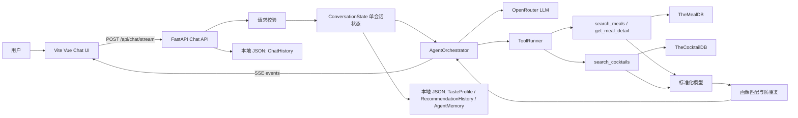

# 智能食谱助手技术设计

| 项目 | 内容 |
|------|------|
| 文档版本 | v0.37 |
| 最近更新时间 | 2026-06-14 22:28:24 CST |
| 文档状态 | ✅ 技术设计已确认，前端展示层级修正、第三方 Markdown 文本渲染、交互优化、最近一天完整聊天记录加载、推荐结果默认收起、流式思考占位和空聊天默认欢迎语已确认 |
| 关联需求 | `智能食谱助手需求分析.md` v0.32 |
| 技术栈 | 后端 Python FastAPI；前端 Vite + Vue 3 + TypeScript |

## 1. 设计目标

基于 `智能食谱助手需求分析.md`，本设计把智能食谱助手拆成前端 Chat UI、FastAPI 后端 Agent、外部 API 适配层、数据标准化层、轻量用户画像与推荐策略几个边界清晰的模块。

核心取舍：

1. 后端承载全部业务逻辑，包括参数校验、语言检测、Tool 调用、外部字段清洗、画像合并、推荐排序和错误降级。
2. 前端只负责交互、展示、表单体验校验和流式事件解析；用户画像、推荐历史和 Agent Memory 由后端本地 JSON 文件持久化。
3. 首版保持单用户、单 Agent、单活跃请求，不做账号、多用户、多 `session`、并发会话合并或跨设备同步。
4. 首版唯一对外 Chat 接口采用 `POST /api/chat/stream` + SSE，覆盖流式文本输出和结构化结果卡片展示；不实现非流式 Chat 接口。
5. 菜品推荐使用轻量用户画像，不引入复杂推荐系统。
6. Tool 参数传给外部 API 前必须完成英文归一化、来源追踪和校验；校验失败最多允许 LLM 基于结构化错误修正 1 次。
7. OpenRouter 默认使用 DeepSeek 系列模型，具体模型 ID 由后端 `OPENROUTER_MODEL` 启动参数指定，且必须支持 Streaming 和 Tool Calling。
8. 完整聊天记录用于前端 UI 恢复，独立保存到 `chat-history.json`，只保留最近 24 小时且最多 60 条消息；不作为 LLM 上下文来源。

## 2. 技术方案选择

### 2.1 方案对比

| 方案 | 优点 | 风险 | 结论 |
|------|------|------|------|
| FastAPI + Vite Vue | Python 适合 Agent 编排；FastAPI 支持异步 HTTP 和流式响应；Vite + Vue 3 前端轻量 | 需要分别维护前后端启动脚本 | 推荐 |
| Next.js 全栈 | 前后端一体，部署简单 | Agent、HTTP 流、外部 Tool 编排都放在 Node 侧，且会引入 React 技术栈 | 不采用 |
| Node.js + Vite | 单语言栈，前端协作顺畅 | LLM 编排和后续测试生态不如 Python 直观 | 可行但不是首选 |

推荐 `FastAPI + Vite Vue 3 TypeScript`，因为本项目重心在 Agent、外部 API 清洗和后端业务编排，不是纯前端应用；前端只需要稳定承载 Chat、文本回复、结构化结果卡片和辅助调试信息展示，Vue 3 足够轻量直接。

### 2.2 流式输出选择

| 方式 | 说明 | 结论 |
|------|------|------|
| `fetch` + `ReadableStream` 解析 SSE | 可使用 `POST` 请求体，适合携带本轮 `message` | 推荐 |
| 原生 `EventSource` | API 简洁，但主要面向 `GET` | 不采用 |
| WebSocket | 双向通信强，但首版只有请求-响应流 | 暂不采用 |

## 3. 总体架构



架构原则：

1. `api` 层只接收参数、调用服务、返回响应。
2. `service` 层处理 Agent 编排、状态流转和外部依赖组合。
3. `tool` 层定义 Agent 可调用能力，包含参数校验和标准化输出。
4. `adapter` 层只负责外部 HTTP 请求，不向上泄露请求细节。
5. `domain` 层定义标准模型、画像规则、推荐规则和语言策略。

## 4. 后端设计

### 4.1 目录结构

```text
backend/
  app/
    main.py
    api/
      chat.py
      health.py
    core/
      config.py
      errors.py
      logging.py
      prompts.json
      sse.py
    domain/
      models.py
      normalizers.py
      language.py
      tool_args.py
      taste_profile.py
      recommendation.py
    services/
      agent_orchestrator.py
      conversation_state.py
      conversation_lock.py
      tool_runner.py
      memory_store.py
      chat_history_store.py
      openrouter_client.py
    tools/
      meal_tool.py
      cocktail_tool.py
    adapters/
      mealdb_client.py
      cocktaildb_client.py
  tests/
    unit/
    integration/
```

### 4.2 模块职责

| 模块 | 职责 |
|------|------|
| `api/chat.py` | 暴露 Chat 流式接口；不写业务规则 |
| `core/config.py` | 读取 OpenRouter、外部 API、超时、模型名等配置 |
| `core/prompts.json` | 存放 system prompt 和 tool_results_prefix 等 LLM 提示词，由 `openrouter_client.py` 在运行时读取；修改提示词只需编辑此文件，无需改代码 |
| `core/errors.py` | 统一业务异常、外部依赖异常和响应错误码 |
| `core/sse.py` | 统一 SSE 事件序列化 |
| `domain/models.py` | Pydantic 请求、响应、卡片、画像、Tool 轨迹模型 |
| `domain/normalizers.py` | 清洗 TheMealDB / TheCocktailDB 原始字段 |
| `domain/language.py` | 按本轮 `message` 检测输出语言 |
| `domain/tool_args.py` | Tool 参数英文归一化、来源追踪、allowlist 校验和修正错误模型 |
| `domain/taste_profile.py` | 画像合并、裁剪、去重、覆盖规则 |
| `domain/recommendation.py` | 推荐打分、防重复、主食材/分类/菜系轮换 |
| `services/agent_orchestrator.py` | Agent 主流程，连接 LLM、Tool、画像和 SSE |
| `services/conversation_state.py` | 当前唯一会话的候选卡片、消息摘要和画像状态 |
| `services/conversation_lock.py` | 单 Agent 活跃请求保护；防止两个页面同时修改同一份 memory |
| `services/tool_runner.py` | 轻量 Tool Harness，统一执行 Tool，负责入参校验、超时、日志、SSE 轨迹和错误包装 |
| `services/memory_store.py` | 统一读写本地 JSON，恢复和持久化画像、推荐历史、Agent Memory |
| `services/chat_history_store.py` | 读写完整 UI 聊天历史，执行最近 24 小时和最多 60 条消息裁剪 |
| `services/openrouter_client.py` | OpenRouter 调用封装；`_build_messages()` 从 `core/prompts.json` 读取 system prompt 和 tool_results_prefix，使用 `lru_cache` 缓存避免重复读取 |
| `tools/meal_tool.py` | 菜谱搜索和详情 Tool |
| `tools/cocktail_tool.py` | 饮品搜索 Tool |
| `adapters/*_client.py` | 外部 API HTTP 请求、超时、重试一次 |
| `data/taste-profile.json` | 后端本地持久化的轻量画像，作为首版画像真实来源 |
| `data/recommendation-history.json` | 后端本地持久化的推荐历史，最多保留最近 20 条 |
| `data/agent-memory.json` | 后端本地持久化的 Agent Memory，保存对话摘要、最近轮次和候选卡片引用 |
| `data/chat-history.json` | 后端本地持久化的完整 UI 聊天历史，最多保留最近 24 小时内的 60 条消息 |

## 5. 前端设计

### 5.1 目录结构

```text
frontend/
  src/
    api/
      chat.ts
      sse.ts
    components/
      ChatPage.vue
      MessageList.vue
      MessageComposer.vue
      AssistantMessage.vue
      AssistantResultBlock.vue
      MealCard.vue
      CocktailCard.vue
      ToolTracePanel.vue
      ProfilePanel.vue
    types/
      chat.ts
    styles/
      app.css
  tests/
```

### 5.2 前端职责

| 模块 | 职责 |
|------|------|
| `api/chat.ts` | 封装 Chat 请求、历史加载和错误处理 |
| `api/sse.ts` | 解析 `meta`、`delta`、`tool_call`、`card`、`profile_update`、`done`、`error` |
| `ChatPage.vue` | 页面容器，维护消息列表、发送状态、本轮 assistant `pending` 展示状态和空聊天默认欢迎语 |
| `MessageList.vue` | 消息列表，只负责按消息角色分发渲染 |
| `MessageComposer.vue` | 输入框、发送按钮、空输入和长度提示；Enter 发送消息，Ctrl+Enter / Cmd+Enter 换行；发送中按钮显示旋转加载图标（Loader2）并禁用 |
| `AssistantMessage.vue` | 单条 Agent 消息展示：`pending` 时展示“思考中”，文本回复直出，按结构化数据决定是否渲染结果区块 |
| `AssistantResultBlock.vue` | 结构化结果区块：仅在 `cards` 非空时展示卡片；超过 3 个推荐时默认展示前 3 个，展开后用横向滑动轨道展示全部，并按需展示食材/步骤、Tool 调用和画像变化辅助视图 |
| `MealCard.vue` | 菜谱卡片展示，不解析外部原始字段 |
| `CocktailCard.vue` | 饮品卡片展示，不解析外部原始字段 |
| `ToolTracePanel.vue` | 展示 Tool 调用链路 |
| `ProfilePanel.vue` | 展示本轮画像变化 |
前端不做：意图识别、食材翻译、推荐排序、画像合并、画像持久化、聊天历史裁剪、权限控制、外部 API 直连。

### 5.3 空聊天默认欢迎语

页面进入时仍先调用 `loadChatHistory()`。如果后端返回历史消息，前端直接使用真实历史初始化 `messages`；如果后端返回空数组，前端使用一条本地 `AssistantMessage` 展示食谱助手欢迎语。

历史加载失败时，前端也展示同一条默认欢迎语，并保持输入框可用。默认欢迎语只属于 UI 空态，不调用 LLM，不写入 `chat-history.json`，不进入 Agent Memory、画像或推荐历史。

## 6. API 契约

### 6.1 流式接口

`POST /api/chat/stream`

请求头：

```http
Content-Type: application/json
Accept: text/event-stream
```

请求体：

```ts
type ChatStreamRequest = {
  message: string;
};
```

首版不接收 `languagePreference` 或 `locale`。输出语言由后端根据本轮 `message` 检测，并在响应事件中返回 `detectedLocale`。

### 6.2 流式降级策略

首版不实现 `POST /api/chat/message` 非流式接口。降级策略如下：

1. 前端发送请求后立即创建本轮 assistant 消息并设置 `pending=true`，展示“思考中”。
2. 收到首个 `delta` 或最终 `done` 时，前端清除 `pending` 并展示实际回复。
3. SSE 请求建立失败时，前端清除 `pending` 并展示“连接失败，请重试”或后端 JSON 错误。
4. SSE 中途断开且未收到 `done` 时，前端保留已收到内容，清除 `pending`，并展示“生成中断，请重试”。
5. 不自动改走非流式接口，避免重复 Tool 调用、重复画像更新和幂等复杂度。
6. 自动化测试直接测试 `AgentOrchestrator`、Tool、领域函数和 SSE 事件解析，不依赖非流式 HTTP 接口。
7. 如果后续部署环境证明 SSE 被网关或代理缓冲，再评估新增非流式接口；新增时必须复用同一个 Agent 事件生成器，不允许复制业务逻辑。

页面初始欢迎语不属于流式消息，不设置 `pending`，也不触发 SSE。

### 6.3 请求校验

| 字段 | 类型 | 必填 | 后端校验 |
|------|------|------|----------|
| `message` | string | 是 | `trim` 后长度 1~1000 |

画像和 Agent Memory 不由前端随请求传入。后端在每轮请求开始时从内存状态读取；服务启动或内存为空时，从 `data/taste-profile.json`、`data/recommendation-history.json` 和 `data/agent-memory.json` 恢复。用户通过自然语言表达偏好时，由 Agent 提取并在后端更新 JSON。

前置校验失败时不建立 SSE 流，直接返回 HTTP JSON 错误：

| 场景 | HTTP 状态 | 响应 |
|------|-----------|------|
| `message` 为空或仅空白 | `400` | `{ "code": 400, "message": "message 不能为空", "data": {} }` |
| `message` 超过 1000 字符 | `400` | `{ "code": 400, "message": "message 长度不能超过 1000", "data": {} }` |

### 6.4 历史消息接口

`GET /api/chat/history`

返回最近 24 小时内、最多 60 条完整聊天消息。该接口只读取 `chat-history.json` 并做裁剪，不调用 LLM、Tool，不更新画像、推荐历史或 Agent Memory。

响应：

```ts
type ChatHistoryResponse = {
  code: 200;
  message: "success";
  data: {
    messages: ChatHistoryMessage[];
  };
};
```

```ts
type ChatHistoryMessage =
  | {
      role: "user";
      content: string;
      createdAt: string;
    }
  | {
      role: "assistant";
      reply: string;
      cards: Card[];
      toolCalls: ToolCallSummary[];
      warnings: string[];
      profileUpdates?: Record<string, unknown>[];
      error?: string;
      createdAt: string;
    };
```

历史文件缺失、JSON 损坏或单条消息校验失败时，后端返回可用的剩余消息；完全不可用时返回空数组。

### 6.5 本地 JSON 持久化、Agent Memory 与 Chat History

首版不引入数据库，使用后端本地 JSON 文件保存单用户轻量画像、推荐历史和 Agent Memory。

```text
backend/
  data/
    taste-profile.json
    recommendation-history.json
    agent-memory.json
    chat-history.json
```

读写规则：

1. 后端启动时读取 JSON 文件；文件不存在时使用空画像、空历史和空 memory。
2. 每次用户请求的 Agent 主流程结束后（无论是正常 `done`、运行期 `error`、超时还是客户端断开收尾），先更新内存状态，再使用同目录临时文件写回 JSON 文件；ReAct 内部多次 LLM ↔ Tool 迭代不单独触发持久化。
3. JSON 写入失败时，本轮回复仍可返回，但 SSE `done` 中应包含持久化失败提示，日志记录异常。
4. 推荐历史最多保留最近 20 条，超过后丢弃最旧记录。
5. 首版按单进程运行设计；如果后续多进程部署，需要改为数据库或带锁的共享存储。
6. `agent-memory.json` 不保存完整原始 Tool 响应、系统提示词或长对话全文，只保存恢复上下文所需的轻量字段。
7. `agent-memory.json` 保存最近 10 轮对话摘要、当前候选卡片引用、最近 Tool 调用摘要和 `lastIntent`。
8. 候选卡片只保存 `type`、`id`、`title`、`rank`、`detailLevel`、主食材、分类和菜系；需要详情时重新调用 `lookup`。
9. `chat-history.json` 保存完整 UI 聊天消息，保留最近 24 小时且最多 60 条；用户消息和助手消息各算 1 条。
10. `chat-history.json` 不作为 LLM 上下文输入；页面进入时通过 `GET /api/chat/history` 加载，用于恢复消息列表。
11. `taste-profile.json`、`recommendation-history.json`、`agent-memory.json` 和 `chat-history.json` 共用可靠写入原则：写入目标同目录临时文件，`flush` 后对临时文件执行 `fsync`，再通过原子 `rename` 覆盖目标文件，最后对父目录执行 `fsync`，降低进程崩溃或断电导致半写、空文件或目录项未落盘的风险。
12. `chat-history.json` 写入失败不影响本轮 SSE 主响应；历史加载失败时前端仍可发送新消息。
13. 临时文件命名固定在目标文件同目录内，失败残留不参与读取；后续写入可覆盖同名临时文件，不在后端执行文件删除操作。

```ts
type AgentMemory = {
  updatedAt: string;
  conversationSummary: string;
  recentTurns: {
    role: "user" | "assistant";
    content: string;
    createdAt: string;
  }[];
  activeCandidates: {
    type: "meal" | "cocktail";
    id: string;
    title: string;
    rank: number;
    detailLevel: "summary" | "detail";
    mainIngredients: string[];
    category?: string;
    cuisine?: string;
  }[];
  lastToolCalls: ToolCallSummary[];
  lastIntent?: string;
};
```

### 6.6 单活跃请求与死锁防护

本项目首版不支持同一 Agent 的多页面并发聊天。后端使用 `conversation_lock` 保护单活跃请求：

1. 请求通过基础校验后，先尝试获取 `conversation_lock`。
2. 如果锁已被其他请求持有，不建立 SSE 流，直接返回 HTTP `409` JSON 错误：`{ "code": 409, "message": "当前已有请求处理中，请稍后再试", "data": {} }`。
3. 不排队等待，不并发生成，不做多请求 memory 合并。
4. 锁只存在于当前后端进程内，不写入 JSON，避免进程崩溃后出现持久化死锁。
5. 锁持有者记录 `requestId`、`acquiredAt` 和最大请求时长，用于日志和超时保护。
6. `conversation_lock` 在 SSE 流建立前获取，覆盖整个 ReAct 主循环（多次 LLM ↔ Tool 迭代直到最终回复），在 `done`、`error` 或客户端断开收尾时统一释放；单次 Tool 调用、单次 LLM 调用都不再单独获取或释放锁。

只有在 SSE 已经建立后发生的运行期异常才通过 SSE `error` 事件返回，例如 Tool 调用失败、OpenRouter 超时、JSON 持久化失败提示或单轮 Chat 超时。前端 `api/chat.ts` 必须先处理非 2xx HTTP JSON 错误，再进入 SSE 解析。

死锁防护规则：

1. `conversation_lock` 必须用异步上下文管理器或 `try/finally` 释放。
2. 正常完成、业务异常、外部 API 异常、OpenRouter 异常、客户端断开、协程取消时都必须释放锁。
3. 所有外部调用必须设置超时；单轮 Chat 必须设置最大执行时长，超时后返回错误并释放锁。
4. `memory_store` 不承担并发控制职责；所有 JSON 写入都必须发生在已持有 `conversation_lock` 的请求内。
5. `memory_store` 只负责读写 JSON 和原子替换，不得在内部获取 `conversation_lock`，避免嵌套锁。
6. JSON 原子写只解决文件半写问题，不承担并发控制职责；并发控制完全由 `conversation_lock` 负责。
7. 如果未来新增不经过 `conversation_lock` 的后台任务或管理接口写入 memory，必须先改为统一获取 `conversation_lock`，或重新设计跨写入方的锁策略。
8. 首版按 FastAPI 单进程部署设计；如果未来启用多进程或多实例，必须升级为数据库、Redis 锁或带租约的跨进程锁。

前端也做体验层校验，但后端仍重复校验所有字段。

## 7. SSE 事件设计

### 7.1 事件类型

| 事件 | 时机 | 数据 |
|------|------|------|
| `meta` | 请求校验通过后立即发送 | `requestId`、`detectedLocale` |
| `tool_call` | Tool 执行前 | Tool ID、名称、参数摘要、状态、可选 `retryOf` |
| `tool_result` | Tool 执行后 | Tool ID、状态、耗时、结果数量、错误摘要、可选校验错误 |
| `delta` | LLM 回复流式输出中 | 增量文本 |
| `card` | 有结构化卡片可展示时 | `{ cards: Card[] }` |
| `profile_update` | 画像发生变化时 | patch 和变化原因 |
| `error` | SSE 流建立后的运行期失败或部分能力失败 | 错误码、文案、`requestId` |
| `done` | 请求结束 | 最终完整快照，可包含非阻塞 `warnings` |

事件顺序约束：

1. 同一次 LLM 调用产生的 `delta` 必须在该次调用产生的任意 `tool_call` 事件之前 flush 完毕；后端不得让 `delta` 与 `tool_call` 在同一次 LLM 调用窗口内交错发送。
2. Tool 执行期间不发送 `delta`；`tool_call` 与对应 `tool_result` 之间允许穿插 `card`、`profile_update` 等结构化事件，但不允许穿插来自其他 LLM 调用的 `delta`。
3. 同一次 LLM 调用返回多个 `tool_calls` 时，串行执行，按 LLM 返回数组顺序逐个发送 `tool_call` / `tool_result`；任一 Tool `failed` 不短路其他 Tool，由 Agent 在收齐结果后决定下一步。
4. `card` 事件必须出现在对应数据所依赖的 `tool_result` 之后；首次 `card` 之前不发 `done`。
5. 任意 `error` 事件之后允许再发 `done` 用作收尾快照，但不再发 `delta` / `tool_call` / `tool_result` / `card` / `profile_update`。

### 7.2 示例

```text
event: meta
data: {"requestId":"req_20260614121622_abcd","detectedLocale":"zh-CN"}

event: tool_call
data: {"id":"tool_1","name":"search_meals","arguments":{"ingredient":"chicken","limit":5},"argumentSources":{"ingredient":"鸡肉"},"status":"started"}

event: tool_result
data: {"id":"tool_1","status":"success","durationMs":420,"resultCount":5}

event: delta
data: {"text":"我给你找了几道适合晚餐的鸡肉菜。"}

event: card
data: {"cards":[{"type":"meal","id":"52795","title":"Chicken Handi"}]}

event: profile_update
data: {"patch":{"likedIngredients":["chicken"]},"reason":"用户表达想吃鸡肉"}

event: done
data: {"reply":"...","cards":[],"tasteProfile":{},"toolCalls":[],"suggestions":[],"warnings":[]}
```

前端以 `done` 事件作为最终状态校准，避免中途流事件丢失导致展示不一致。

`card` 事件和 `done.cards` 必须使用同一个统一结构：`{ cards: Card[] }`。后端负责把菜谱和饮品都序列化为带 `type` 的 `Card` 联合类型；前端只根据 `type` 分发到 `MealCard.vue` 或 `CocktailCard.vue`，不自行猜测卡片来源。

展示触发规则：

1. `delta` 和 `done.reply` 只更新 Agent 文本回复，不触发结果卡片容器。
2. 只有收到 `card` 事件且 `cards.length > 0`，或 `done.cards.length > 0` 时，当前 Agent 消息才渲染 `AssistantResultBlock`。
3. `cards` 为空时不展示“推荐”“食材/步骤”空容器，也不显示“暂无推荐”占位；空结果说明由 `reply` 文本承担。
4. `tool_call`、`tool_result`、`profile_update` 可以先进入消息状态，但默认不把整条 Agent 消息提升为页签容器；当存在结构化结果区块时，作为结果区内辅助视图展示。
5. `done.warnings` 作为非阻塞提示展示在 Agent 消息内，不清空已收到的文本回复或卡片。
6. 当 `cards.length > 3` 时，结果区默认只展示前 3 个卡片；点击“查看更多”后展示全部卡片，并把卡片容器切换为横向可滚动滑块；同按钮文案变为“收起”，点击后恢复默认 3 个。
7. 食材/步骤辅助区必须与当前可见卡片保持一致，默认态不展示第 4 个及后续隐藏卡片的步骤。

## 8. 数据模型

### 8.1 食材模型

```ts
type IngredientItem = {
  name: string;
  measure?: string;
};
```

### 8.2 卡片模型

```ts
type MealCard = {
  type: "meal";
  id: string;
  detailLevel: "summary" | "detail";
  title: string;
  localizedTitle?: string;
  localizedLanguage?: string;
  imageUrl: string;
  category?: string;
  country?: string;
  tags: string[];
  ingredients: IngredientItem[];
  instructions?: string[];
  localizedSummary?: string;
  localizedInstructions?: string[];
  matchReasons?: string[];
  sourceUrl?: string;
  youtubeUrl?: string;
};

type CocktailCard = {
  type: "cocktail";
  id: string;
  detailLevel: "summary" | "detail";
  title: string;
  localizedTitle?: string;
  localizedLanguage?: string;
  imageUrl: string;
  category?: string;
  alcoholic?: string;
  glass?: string;
  tags: string[];
  ingredients: IngredientItem[];
  instructions?: string[];
  localizedSummary?: string;
  localizedInstructions?: string[];
  matchReasons?: string[];
};

type Card = MealCard | CocktailCard;
```

### 8.3 轻量画像模型

```ts
type TasteProfile = {
  dietaryRestrictions: string[];
  likedIngredients: string[];
  dislikedIngredients: string[];
  preferredCuisines: string[];
  flavorPreferences: string[];
  allowAlcohol?: boolean;
};
```

`TasteProfile` 只保存用户偏好，不保存对话状态或推荐日志。`lastIntent` 归 `AgentMemory`，`RecommendationRecord[]` 由 `recommendation-history.json` 独立持久化。

### 8.4 推荐历史模型

```ts
type RecommendationRecord = {
  itemType: "meal" | "cocktail";
  itemId: string;
  title: string;
  recommendedAt: string;
  mainIngredients: string[];
  category?: string;
  cuisine?: string;
  matchReasons: string[];
};
```

画像规则：

1. `languagePreference` 不进入画像。
2. 显式表达优先，例如“我不吃牛肉”立即写入 `dislikedIngredients`。
3. 新消息可以覆盖旧偏好，例如“今天可以喝酒”更新 `allowAlcohol`。
4. 推荐结果必须给出至少一个 `matchReasons`。
5. 画像只做偏好辅助，不做医疗、过敏或营养精确判断。

推荐历史规则：

1. 推荐历史使用纵向对象数组，最多保留 20 条。
2. 推荐历史只记录实际展示给用户的推荐。
3. 推荐历史用于短期防重复、主食材/分类/菜系轮换，不作为用户偏好字段展示。

## 9. Tool 设计

### 9.0 ToolRunner 执行外壳

`services/tool_runner.py` 作为轻量 Tool Harness，统一包裹 `meal_tool.py` 和 `cocktail_tool.py` 的执行过程。

职责：

1. 校验 Tool 入参，统一处理空字符串、`limit` 范围和必填 ID。
2. 在 Tool 执行前后生成 `tool_call` / `tool_result` 事件所需数据。
3. 记录 Tool 名称、参数摘要、耗时、结果数量和错误摘要。
4. 包装外部 API 超时、网络错误和空结果，转为统一 Tool 执行结果。
5. 对可重试的网络错误或 5xx 响应执行最多 1 次重试；该重试属于网络层，不消耗 Agent 决策层的步数预算（见 9.0.2），也不产生 `retryOf` 事件。
6. 对校验失败返回结构化 `validation_error`，供 Agent 最多触发 1 次参数修正（与 ReAct 步数预算共同生效，见 9.0.1 / 9.0.2）。

非职责：

1. 不决定 Agent 应调用哪个 Tool。
2. 不做推荐排序、防重复、画像合并、语言翻译或参数语义推断。
3. 不直接调用 TheMealDB / TheCocktailDB；外部 HTTP 仍由 `adapters/*_client.py` 承担。

执行关系：

```text
AgentOrchestrator -> ToolRunner -> meal_tool / cocktail_tool -> adapter
```

通用查询数量规则：

1. TheMealDB / TheCocktailDB 不提供 `total`、`limit`、`page` 或游标能力，后端无法证明外部 API 单次返回的是全部匹配结果。
2. Tool 入参中的 `limit` 只限制本系统返回给前端的候选数量和 `lookup` 补详情数量，不传递给外部 API。
3. 后端基于一次外部 API 调用返回的数组做去重、排序、过滤和最多 `limit` 条截取。
4. `filter` 摘要结果需要补详情时，只对截取后的候选调用 `lookup`。
5. 如果用户需要“更多结果”，首版不做分页续查；可在后续通过更换查询条件或新增外部数据源评估。

Tool 执行结果状态：

| 状态 | 含义 |
|------|------|
| `success` | Tool 成功返回至少 1 条可用结果 |
| `empty` | 外部 API 正常返回空结果，不视为系统失败 |
| `partial_success` | 部分详情补全、标准化或过滤失败，但仍有可展示结果 |
| `validation_failed` | 入参校验失败，未调用外部 API |
| `failed` | 外部 API、标准化或必要 Tool 失败，无法得到可用结果 |

### 9.0.1 Tool 参数英文归一化与修正协议

外部 API 查询参数只接收英文。`AgentOrchestrator` 在调用 ToolRunner 前，先使用 `domain/tool_args.py` 把 LLM 提取出的原始语义归一化为英文 Tool 参数，并保留内部来源元数据：

```ts
type NormalizedToolArg = {
  value: string;
  sourceText: string;
  source: "user_message" | "agent_memory" | "candidate_card" | "allowlist";
  confidence: "high" | "medium" | "low";
};
```

规则：

1. 传给 `meal_tool.py` / `cocktail_tool.py` 的 `ingredient` 和 `query` 必须是英文词或英文短语，不得包含中文字符；`argumentSources` 记录对应用户原文或 memory 来源。
2. `category` 和 `area` 必须来自 TheMealDB 支持的英文 allowlist 或明确映射。
3. `idMeal` / `idDrink` 只能来自上一轮候选卡片、当前 Tool 结果或外部 API 返回，不能由 LLM 翻译、猜测或生成。
4. 用户表达“随便推荐”但没有具体食材或关键词时，走默认推荐或随机推荐，不补造 `ingredient` / `query`。
5. ToolRunner 校验失败时返回结构化错误，例如 `{ field, reason, retryable, allowedValues }`，并发送 `tool_result.status="validation_failed"`；此时不调用外部 API。
6. Agent 收到可重试校验错误后，可把错误信息反馈给 LLM 重新生成参数；整轮 Chat 累计 `retryOf` 次数 ≤ 1，跨 Tool 共享，不允许"每个 Tool 各修正 1 次"。新的 `tool_call` 事件必须带 `retryOf` 指向上一次失败调用。
7. 修正后的参数仍必须满足来源可追溯和英文约束。二次校验失败时停止 Tool 调用，按用户提问语言追问或说明缺少信息。
8. 参数修正过程不得写入 `recommendation-history.json`；只有实际展示给用户的卡片才记录推荐历史。

### 9.0.2 ReAct 主循环步数预算与熔断

`AgentOrchestrator` 的 ReAct 主循环（`LLM 推理 → tool_call → tool_result → LLM 推理 → ...`）必须在以下三个维度共同约束下运行，避免单轮 Chat 在 90 秒总超时之前不受控地反复调用 Tool：

| 维度 | 默认上限 | 计数口径 | 触发后行为 |
|------|----------|----------|----------|
| `maxToolCalls` | 9 | 整轮 Chat 内所有成功、失败、`validation_failed`、`retryOf` 的 `tool_call` 累计计数 | 强制进入收尾：禁止再产生新的 `tool_call`，要求 LLM 基于现有上下文输出最终回复，并在 `done.warnings` 追加“已达 Tool 调用上限”提示 |
| `maxLlmSteps` | 6 | 整轮 Chat 内 OpenRouter 推理调用次数（首次规划 + 每次接收到 `tool_result` 后的再推理） | 同上，禁止再发起新的 LLM 调用，使用最近一次 LLM 输出作为收尾文本；若没有任何 LLM 文本输出则发送 `error` |
| 同 Tool + 相同归一化参数 | 命中 1 次熔断 | 以 `(toolName, normalizedArgsHash)` 为键，整轮 Chat 内只允许出现 1 次实际外部调用；`retryOf` 修正后的调用使用新的归一化参数键，不与原失败键合并 | 命中熔断时不再调用外部 API，直接复用上一次 `tool_result` 内容并发送新的 `tool_result` 事件，状态置为 `cached`，`durationMs=0`，并在 Agent 上下文中告知 LLM “该 Tool 已用相同参数调用过” |

补充规则：

1. 三个维度独立计数；任一命中即触发对应行为，不互相替代。
2. 上限值默认通过启动配置 `AGENT_MAX_TOOL_CALLS` / `AGENT_MAX_LLM_STEPS` 覆盖，不在请求中暴露。
3. ToolRunner 的网络层重试（9.0 第 5 点）不计入 `maxToolCalls`；`retryOf` 参数修正、Agent 主动改换 Tool、改换参数都计入。
4. 熔断使用的 `normalizedArgsHash` 基于 `domain/tool_args.py` 归一化后的英文参数计算，忽略 `argumentSources` 等元数据，避免来源标注差异导致重复调用。
5. 熔断状态 `cached` 仅在 `tool_result` 中出现，不进入 9.0 的状态枚举主集合，前端 Tool 辅助区按"复用上次结果"展示。
6. 触发收尾或熔断时，Agent 必须仍走完 `done` 事件，把 `warnings` 与最终快照一并返回，避免前端停留在加载态。
7. 90 秒单轮 Chat 总超时（第 14 条）作为最外层兜底，不替代步数预算；步数预算先于总超时介入。

执行关系（更新）：

```text
AgentOrchestrator
  └─ ReAct loop (maxLlmSteps / maxToolCalls / dedup cache)
       ├─ OpenRouter 规划/续写
       └─ ToolRunner -> meal_tool / cocktail_tool -> adapter
```

### 9.1 `search_meals`

输入：

```ts
type SearchMealsArgs = {
  query?: string;
  ingredient?: string;
  category?: string;
  area?: string;
  limit?: number;
  recommendationMode?: boolean;
};
```

端点选择：

首版不做多条件组合查询。多个查询参数同时存在时，只选择一个主查询条件调用外部接口，优先级为 `ingredient > category > area > query > random`。未被选为主查询的条件只用于后端排序、过滤或推荐理由，不触发额外外部接口合并。

| 条件 | TheMealDB 接口 |
|------|----------------|
| `ingredient` 非空 | `filter.php?i={ingredient}` |
| `category` 非空 | `filter.php?c={category}` |
| `area` 非空 | `filter.php?a={area}` |
| `query` 非空 | `search.php?s={query}` |
| 默认推荐 | `random.php` |

规则：

1. `limit` 默认 5，范围 1~10，只限制后端返回候选和补详情数量。
2. `ingredient` / `query` 必须是英文归一化结果，不得包含中文字符；普通搜索不得把空字符串透传给 `search.php?s=`。
3. `filter` 结果只有摘要字段，后端从外部返回数组中取最多 `limit` 条调用 `lookup.php?i={idMeal}` 补详情。
4. `lookup` 部分失败时保留可用摘要，标记 `detailLevel="summary"`。
5. `strCountry` 优先，缺失时回退 `strArea`。
6. 遍历 `strIngredient1~20` 和 `strMeasure1~20`。
7. 同一轮结果按 `idMeal` 去重。

### 9.2 `get_meal_detail`

输入：

```ts
type GetMealDetailArgs = {
  idMeal: string;
};
```

规则：

1. `idMeal` 必须是非空数字字符串，最大 20 位，并且来自候选卡片、Tool 结果或外部 API 返回。
2. 调用 `lookup.php?i={idMeal}`。
3. `{"meals": null}` 视为空结果，不视为系统异常。
4. 返回 `detailLevel="detail"` 的 `MealCard`。
5. 如果会话候选卡片已有相同 ID 的详情，可复用，减少外部请求。

### 9.3 `search_cocktails`

输入：

```ts
type SearchCocktailsArgs = {
  query?: string;
  ingredient?: string;
  limit?: number;
  allowAlcohol?: boolean;
  recommendationMode?: boolean;
};
```

端点选择：

首版不做多条件组合查询。多个查询参数同时存在时，只选择一个主查询条件调用外部接口，优先级为 `ingredient > query > random`。`allowAlcohol` 不参与端点选择，只作为结果过滤条件。

| 条件 | TheCocktailDB 接口 |
|------|--------------------|
| `ingredient` 非空 | `filter.php?i={ingredient}` |
| `query` 非空 | `search.php?s={query}` |
| 默认推荐 | `random.php` |

规则：

1. `filter.php?i` 只返回 3 字段摘要，后端从外部返回数组中取最多 `limit` 条调用 `lookup.php?i={idDrink}` 补详情。
2. `ingredient` / `query` 必须是英文归一化结果，不得包含中文字符。
3. 兼容 `{"drinks": null}` 和顶层 `{"drinks": "no data found"}`。
4. 遍历 `strIngredient1~15` 和 `strMeasure1~15`。
5. 不依赖 `strInstructionsZH-HANS` 或 `strInstructionsZH-HANT`。
6. `allowAlcohol=false` 时过滤 `strAlcoholic="Alcoholic"`。
7. 饮品默认推荐不使用空搜索，使用 `random.php`。
8. 同一轮结果按 `idDrink` 去重。

## 10. 语言与本地化策略

| 场景 | 处理 |
|------|------|
| 中文输入 | `detectedLocale="zh-CN"`，回复、推荐理由、摘要和必要步骤解释使用中文 |
| 英文输入 | `detectedLocale="en-US"`，回复和解释使用英文 |
| 中英混合 | 按主要语言判断；如果包含明显中文意图词，优先中文 |
| API 查询参数 | 转为英文食材、分类、地区或关键词，并保留来源元数据 |
| `title` | 永远保留外部 API 原始英文名 |
| `instructions` | 永远保留外部 API 原始英文步骤；后端只做清洗和拆段 |
| `localizedTitle` | 可选辅助展示，不替代 `title` |
| `localizedSummary` | 列表推荐默认生成，按本轮 `detectedLocale` 输出 |
| `localizedInstructions` | 只在详情场景生成，例如用户问“怎么做”“第一个详细步骤”；列表推荐不默认翻译完整步骤 |
| `localizedLanguage` | 等于本轮 `detectedLocale`，不进入用户画像，不持久化为语言偏好 |

语言检测只影响本轮响应，不进入用户画像。前端展示时应把 `title` / `instructions` 视为外部 API 原文，把 `localized*` 字段视为 Agent 基于本轮输出语言生成的辅助解释或翻译，避免把机器翻译误认为原始数据。

### 10.1 LLM 输出语言传递协议

`AgentOrchestrator` 在检测本轮语言后，必须把 `detectedLocale` 写入传给 LLM 的上下文。`OpenRouterStepLlm` 组装消息时必须把该语言作为显式输出约束写入 system prompt，而不是只依赖模型从用户原文自行判断。

Tool 结果回填给 LLM 时，Tool JSON 前必须附带本轮输出语言约束：

1. 最终自然语言回复必须使用 `detectedLocale` 对应语言。
2. 只能基于 Tool JSON 中的事实解释推荐，不得编造菜谱、饮品、ID 或外部字段。
3. 外部 API 原始名称可以保留英文，但推荐理由、筛选依据、注意事项和下一步建议必须使用输出语言。
4. Tool 失败、校验失败或无结果时，也必须使用输出语言说明问题或追问缺少信息。

### 10.2 卡片本地化合并规则

Tool 标准化层仍只负责清洗外部 API 原始字段，不直接翻译；`AgentOrchestrator` 在卡片进入 `card` 事件和 `done.cards` 前，统一执行本地化合并。

| 字段 | 规则 |
|------|------|
| `localizedLanguage` | 必须设置为本轮 `detectedLocale` |
| `localizedSummary` | 列表和详情卡片都生成；中文使用中文模板解释类型、来源和核心食材/配料，英文使用英文模板 |
| `localizedInstructions` | 仅当用户本轮询问做法、步骤、详情或 how-to 意图时生成；不覆盖 `instructions` |
| `localizedTitle` | 首版可为空，避免把机器生成标题误认为外部 API 原始名称 |

本地化合并只做展示层解释，不改变推荐排序、历史记录去重、候选 ID、外部 API 原始字段或 Tool 调用参数。若后续引入专业翻译模型，应在该合并层后扩展，仍保留 `instructions` 原文。

## 11. 数据清洗规则

统一空值判断：

| 原始值 | 处理 |
|--------|------|
| `null` | 空 |
| `undefined` | 空 |
| `""` | 空 |
| `" "` | 空 |
| `"null"` | 空 |
| 顶层 `drinks: "no data found"` | 空结果 |

清洗要求：

1. 所有字符串 `trim`。
2. `"no data found"` 只在 TheCocktailDB `filter` 的顶层 `drinks` 字段中作为空结果处理；普通文本字段不按该值做全局空值清洗。
3. 食材和用量按编号配对：`ingredient` 为空时整行跳过；`ingredient` 有值但 `measure` 为空时保留食材并省略用量；`measure` 有值但 `ingredient` 为空时跳过该用量。
4. 标签按逗号拆分，空标签跳过。
5. 步骤拆分保持保守：`trim` 后按换行或明显步骤标记拆段，去掉空段；如果无法识别清晰步骤，则保留为单段数组，不强行编号、不重写、不翻译。
6. 翻译后的步骤只写入 `localizedInstructions`，不覆盖 `instructions`。
7. 前端不接触外部原始编号字段。

## 12. 推荐与防重复

推荐算法使用轻量规则：

1. 偏好加分：命中 `likedIngredients`、`preferredCuisines`、`flavorPreferences` 加分。
2. 硬过滤：命中 `dislikedIngredients` 或明确饮食限制时过滤；无法确定时降权并提示。
3. 默认含酒精策略：未设置 `allowAlcohol` 时允许含酒精饮品进入候选，但回复不得主动鼓励饮酒。
4. 硬过滤：用户表达不喝酒、无酒精或不要酒精时，将 `allowAlcohol=false` 写入本轮画像并过滤含酒精饮品。
5. 硬去重：泛化推荐场景下，最近 10 条出现过的同一 `itemId` 不再作为新推荐返回；用户明确要求查看该条详情时不适用该规则。
6. 软降权：最近 3 条中同一主食材出现 2 次以上时降低排序权重。
7. 软降权：同一分类或菜系近期高频出现时降低排序权重。
8. 兜底规则：硬过滤和硬去重不可突破；如果过滤后没有可用候选，返回无合适结果并说明原因。软降权可以回退；如果候选不足，仍返回最高分候选，并解释近期已推荐过类似主食材、分类或菜系。
9. 只把实际展示给用户的推荐追加到 `recommendation-history.json` 的 `RecommendationRecord[]`。

跨天重复推荐依赖后端本地 JSON 中的推荐历史。只要后端 `data/` 目录未被清空，重启服务或刷新页面后仍能继续使用最近推荐记录；换机器部署或删除 JSON 文件后，首版不承诺记住历史。

## 13. 前端 Agent 消息展示层级

Agent 消息按“文本优先、结构化结果按需追加”的层级展示。普通问候、解释、追问、错误说明等文本回复不进入卡片容器；只有本轮消息返回可展示 `Card[]` 时，才在文本下方追加结构化结果区块。

| 区域 | 触发条件 | 内容 |
|------|----------|------|
| 文本回复 | 始终存在，来源于 `delta` 或 `done.reply` | Agent 流式文本、追问、空结果说明、错误解释 |
| 结果卡片区 | `cards.length > 0` | 菜谱卡片和饮品卡片 |
| 食材/步骤辅助区 | `cards.length > 0` 且卡片含 `ingredients` 或 `instructions` | 当前卡片的食材、用量和做法 |
| Tool 调用辅助区 | 有 Tool 轨迹，优先在结果区内展示 | Tool 名称、参数摘要、状态、耗时、结果数 |
| 画像变化辅助区 | 有 `profile_update` 或最终 `profileUpdates`，优先在结果区内展示 | 本轮新增或变化的偏好、推荐历史说明 |
| 非阻塞警告 | `warnings.length > 0` | 本次偏好或历史可能未保存等提示 |

状态规则：

1. `delta` 追加到文本回复。
2. `card` 只更新结构化卡片状态；非空时才显示结果卡片区。
3. `tool_call` 和 `tool_result` 更新 Tool 轨迹状态，不单独把普通回复变成页签容器。
4. `profile_update` 更新画像变化状态，不单独把普通回复变成页签容器。
5. `done` 用最终快照覆盖当前消息状态。
6. `error` 展示错误文案并恢复输入。

文本渲染规则：

1. Agent 文本回复允许包含 Markdown 排版标记，例如标题、加粗、列表、链接、代码块和分隔线。
2. `MarkdownReply.vue` 使用 `marked` 将 Markdown 转为 HTML，再使用 `DOMPurify` 清洗危险标签和属性。
3. 前端只对 DOMPurify 清洗后的 HTML 使用 `v-html`；不得把模型原始输出直接注入 DOM。
4. 复杂业务语义仍由后端决定，Markdown 仅作为展示排版，不改变推荐、画像或 Tool 结果逻辑。

## 14. 错误处理与降级

| 场景 | 后端处理 | 前端展示 |
|------|----------|----------|
| 空消息或超长消息 | 不建立 SSE 流，返回 HTTP `400` JSON 错误 | 输入框提示 |
| OpenRouter Key 缺失 | 启动检查或健康检查失败 | 服务不可用 |
| OpenRouter 超时 | SSE 已建立时发送 `error` 事件，不继续编造结果 | 稍后重试提示 |
| Tool 入参校验失败 | 发送 `tool_result.status="validation_failed"`，不调用外部 API；Agent 基于结构化错误最多修正 1 次 | Tool 辅助区显示校验失败和修正过程；无结构化结果时优先展示文本说明 |
| Tool 参数修正失败 | 停止 Tool 调用，按用户提问语言追问缺少信息或说明无法确认参数 | 展示追问或可读说明 |
| 外部 API 超时 | Tool 失败，Agent 尽量返回解释 | Tool 辅助区显示失败；无结构化结果时优先展示文本说明 |
| 外部 API 空结果 | `cards=[]`，回复说明无结果 | 空结果文案 |
| `filter` 补详情部分失败 | 展示成功项，失败项降级为摘要或丢弃 | Tool 辅助区显示部分成功 |
| 所有必要 Tool 失败 | Agent 不编造菜谱或饮品，发送可读失败说明；必要时追加 SSE `error` | 展示失败说明和重试提示 |
| 图片加载失败 | 后端不重试图片 | 前端显示占位 |
| 本地 JSON 损坏 | 后端忽略损坏文件，使用空画像、空历史或空 memory，并记录日志 | 展示可读提示 |
| 聊天历史损坏 | 后端忽略损坏历史文件或非法消息，返回空历史或剩余合法历史 | 页面以空历史继续可用 |
| 本地 JSON 写入失败 | 本轮回复和卡片仍可返回，`done.warnings` 携带持久化失败提示，并记录日志；不重试、不阻塞主回复 | 提示本次偏好或历史可能未保存 |
| 客户端中途断开 | 捕获取消或断开信号，释放 `conversation_lock`；若尚未进入最终持久化阶段，不保证本轮画像、memory 或推荐历史已保存 | 已收到内容保留，提示生成中断 |
| 已有请求处理中 | 不建立 SSE 流，返回 HTTP `409` JSON 错误，不进入 Agent 执行 | 提示稍后再试 |
| 单轮 Chat 超时 | SSE 已建立时发送 `error` 事件，释放 `conversation_lock` 后关闭流 | 展示稍后重试 |
| ReAct 步数预算耗尽 | 达到 `maxToolCalls` 或 `maxLlmSteps` 时停止再调用 Tool / LLM，使用现有上下文产出最终回复，`done.warnings` 追加“已达调用上限”，仍正常发送 `done` | Tool 辅助区显示已达上限提示，文本区展示 LLM 收尾文本 |
| 同 Tool 相同参数重复调用 | 命中熔断后不再请求外部 API，发送 `tool_result.status="cached"` 并复用上一次结果 | Tool 辅助区展示“复用上次结果” |
| ToolRunner 网络层重试后仍失败 | `tool_result.status="failed"` 反馈给 Agent；Agent 在不超出步数预算时可改换 Tool 或参数，否则进入“所有必要 Tool 失败”分支 | 与对应分支一致 |

默认超时建议：

| 依赖 | 超时 | 重试 |
|------|------|------|
| TheMealDB / TheCocktailDB | 8 秒 | 网络错误或 5xx 重试 1 次 |
| OpenRouter 规划调用 | 30 秒 | 不自动重试 |
| OpenRouter 流式回复 | 首包 30 秒 | 不自动重试 |
| 单轮 Chat 总时长 | 90 秒 | 不自动重试，必须释放 `conversation_lock` |
| ReAct `maxToolCalls` | 6 次 | 触发后强制收尾，不重试 |
| ReAct `maxLlmSteps` | 4 步 | 触发后强制收尾，不重试 |
| 同 Tool 相同参数熔断 | 1 次 | 命中后复用上次结果，不重试 |

## 15. 日志与安全

### 15.1 日志方案

| 链路 | 字段 |
|------|------|
| 请求入口 | `requestId`、消息长度、检测语言、是否加载到画像、画像字段数、历史条数 |
| Agent | 意图类型、Tool 数量、最终卡片数量、耗时、`maxToolCalls` / `maxLlmSteps` 触发标记、熔断命中次数 |
| Tool | Tool 名称、英文参数摘要、参数来源记录状态、外部端点、状态、耗时、结果数量、补详情数量 |
| 画像 | 更新字段名、历史追加数量、降权原因摘要 |
| 参数修正 | `validation_failed`、`retryOf`、修正次数、失败字段、失败原因 |
| 错误 | 异常类型、依赖名称、HTTP 状态、`requestId`、敏感日志开关状态 |

敏感日志默认关闭，通过启动参数显式开启：

| 内容 | 默认 | 启动参数 |
|------|------|----------|
| 完整系统提示词 | 不记录 | `LOG_FULL_SYSTEM_PROMPT=true` |
| 完整用户消息正文 | 不记录 | `LOG_FULL_USER_MESSAGE=true` |
| 完整 Tool 参数来源 `sourceText` | 不记录 | `LOG_FULL_SOURCE_TEXT=true` |
| 外部请求敏感 Header | 不记录 | `LOG_SENSITIVE_EXTERNAL_HEADERS=true` |
| 完整异常堆栈 | 不记录 | `LOG_STACK_TRACE=true` |

安全规则：

1. 上述开关默认全部为 `false`，只建议本地调试或受控排障时开启。
2. OpenRouter API Key 和其他明确密钥值即使开启敏感 Header 日志，也必须脱敏，不允许完整明文输出。
3. 未开启敏感日志时，`argumentSources.sourceText` 只记录是否存在、来源类型和长度，不记录完整原文。
4. 启动时记录敏感日志开关状态，便于排查线上误开。
5. 前端不接触 OpenRouter Key，也不展示敏感日志内容。

### 15.2 配置

```text
OPENROUTER_API_KEY=
OPENROUTER_MODEL=deepseek/<model-id>
OPENROUTER_BASE_URL=https://openrouter.ai/api/v1
MEALDB_BASE_URL=https://www.themealdb.com/api/json/v1/1
COCKTAILDB_BASE_URL=https://www.thecocktaildb.com/api/json/v1/1
OUTBOUND_HTTP_PROXY=
OUTBOUND_HTTP_TRUST_ENV=true
AGENT_MAX_TOOL_CALLS=6
AGENT_MAX_LLM_STEPS=4
LOG_FULL_SYSTEM_PROMPT=false
LOG_FULL_USER_MESSAGE=false
LOG_FULL_SOURCE_TEXT=false
LOG_SENSITIVE_EXTERNAL_HEADERS=false
LOG_STACK_TRACE=false
```

`OPENROUTER_MODEL` 首版必须配置为 OpenRouter 上的 DeepSeek 系列模型，且该模型需要同时支持 Streaming 和 Tool Calling。前端只配置后端 API 地址，不接触 OpenRouter Key。

`OUTBOUND_HTTP_PROXY` 用于本地或服务器需要显式出站代理访问 OpenRouter、TheMealDB、TheCocktailDB 的场景，例如 `http://127.0.0.1:7890`；留空表示不设置显式代理。`OUTBOUND_HTTP_TRUST_ENV=true` 表示 httpx 允许读取进程环境中的代理配置。

## 16. 测试设计

### 16.1 后端单元测试

| 模块 | 测试重点 |
|------|----------|
| `language.py` | 中文、英文、中英混合检测 |
| `tool_args.py` | 中文到英文参数归一化、来源追踪、allowlist 校验、非英文参数拒绝、二次修正失败 |
| `logging.py` | 敏感日志开关默认关闭；单个开关只放开对应内容；完整系统提示词、完整用户消息、完整 `sourceText`、敏感 Header 分别受控；API Key 始终脱敏 |
| `normalizers.py` | 空值、顶层 `no data found`、食材/用量非对称配对、保守步骤拆分、`strCountry` 优先 |
| `taste_profile.py` | 去重、覆盖、历史裁剪、非法字段忽略 |
| `recommendation.py` | 同 ID 泛化推荐硬去重、主食材高频软降权、硬过滤无候选不强推、软降权可回退、只记录实际展示卡片 |
| `memory_store.py` | JSON 文件不存在、损坏、临时文件写入、文件 `fsync`、原子 `rename`、目录 `fsync`、原子写入失败、Agent Memory 恢复；写入失败不覆盖内存主流程结果 |
| `chat_history_store.py` | 历史文件不存在、损坏、非法消息跳过、最近 24 小时裁剪、最多 60 条裁剪、写入失败 warning |
| `conversation_lock.py` | 同时请求只允许一个进入；异常、取消、超时、客户端断开后释放锁 |
| `tool_runner.py` | 入参校验、`validation_failed`、超时包装、重试一次、`tool_call` / `tool_result` 轨迹、错误摘要 |
| `agent_orchestrator.py` | ReAct 步数预算（`maxToolCalls` / `maxLlmSteps`）触发收尾、同 Tool 相同归一化参数命中熔断返回 `cached`、`retryOf` 跨 Tool 累计仅 1 次、并行 `tool_calls` 串行执行顺序、`delta` 与 `tool_call` 不交错 |
| `meal_tool.py` | 端点选择、空搜索保护、Tool `limit` 截取、`filter -> lookup` |
| `cocktail_tool.py` | `drinks: null`、顶层 `no data found`、无酒精过滤 |
| `sse.py` | 事件序列化、JSON 转义、`done.warnings` 序列化 |

### 16.2 后端集成测试

| 场景 | 验证 |
|------|------|
| 中文鸡肉搜索 | Tool 参数为 `chicken`，回复语言中文 |
| 中文参数归一化 | 用户输入中文食材或菜名时，`ingredient` / `query` 入参为英文且保留来源摘要 |
| 参数校验修正 | 首次 Tool 参数非法时发送 `validation_failed`，LLM 基于错误修正 1 次后再调用 |
| 防幻觉参数 | 无候选 ID 或来源不可追溯时，不生成假 ID 或假食材，改为追问 |
| 英文晚餐推荐 | 回复语言英文，返回主菜卡片 |
| “第一个怎么做” | 复用上一轮候选 ID，调用详情 Tool |
| 配饮推荐 | 同轮返回主菜和饮品卡片 |
| `filter` 补详情 | `limit` 不传递给外部 API，仅限制后端候选截取和 `lookup` 数量 |
| 外部 API 超时 | 返回 Tool 失败事件和可读错误 |
| 本地 JSON 写入失败 | 主回复和卡片仍返回，`done.warnings` 出现持久化失败提示 |
| 客户端中途断开 | 释放 `conversation_lock`，后续请求可正常进入 |
| 画像驱动推荐 | 不喜欢食材被避开，推荐理由体现画像 |
| 连续牛肉历史 | 牛肉候选降权，优先推荐其他主食材 |
| 硬过滤无候选 | 明确不吃或饮食限制过滤后无候选，不突破限制、不返回卡片 |
| 软降权回退 | 只有近期重复主食材候选时，返回最高分候选并说明重复风险 |
| 页面刷新后追问 | 从 `agent-memory.json` 恢复候选卡片，支持“第一个怎么做” |
| 页面进入加载历史 | 从 `chat-history.json` 返回最近 24 小时、最多 60 条完整消息 |
| 两页面同时发送 | 第二个请求收到已有请求处理中，不能并发修改 memory |
| ReAct 步数熔断 | LLM 持续要求调用 Tool 时，`maxToolCalls` 命中后停止再调用并产生 `done.warnings` 提示 |
| 同 Tool 相同参数熔断 | LLM 重复请求相同归一化参数时，第二次返回 `tool_result.status="cached"` 且不命中外部 API |
| `retryOf` 跨 Tool 累计 | 第一次 Tool 修正成功后，第二个 Tool 再次 `validation_failed` 时不再触发新的 `retryOf`，直接进入失败分支 |

### 16.3 前端测试

| 模块 | 测试重点 |
|------|----------|
| `sse.ts` | 解析各类 SSE 事件，包括 `done.warnings` |
| `ChatPage` | 页面挂载时加载最近 24 小时、最多 60 条历史消息；历史为空或加载失败时展示默认欢迎语；加载失败不阻断发送 |
| `MessageComposer` | 空消息禁发、长度限制、发送中禁用 |
| `AssistantMessage` / `AssistantResultBlock` | 无卡片时只展示文本和警告，不渲染推荐容器；发送后无回复无错误时展示“思考中”，收到内容或错误后替换；有卡片时文本与结果区同时保留；超过 3 个推荐时默认只显示前 3 个，点击“查看更多”后以横向滑块展示全部并可“收起”；Markdown 通过 `marked + DOMPurify` 渲染并清洗危险 HTML；`done.warnings` 展示为非阻塞提示，不清空已展示回复和卡片 |
| `MealCard` / `CocktailCard` | 缺失字段不崩溃，不显示空标签；优先展示 `localizedSummary` |
| 本地化步骤展示 | `localizedInstructions` 存在时优先展示本地化步骤，否则展示外部 API 原始 `instructions` |
| 本地 JSON 持久化 | 文件不存在时初始化空画像、空历史和空 memory；损坏时忽略并记录错误；写入失败时通过 `done.warnings` 返回可读提示 |

推荐工具：

```text
后端：pytest、pytest-asyncio、httpx、respx
前端：vitest、@vue/test-utils
```

## 17. 实现分期

| 阶段 | 范围 | 验收 |
|------|------|------|
| Phase 1 | 后端领域模型、标准化、Tool 参数归一化、ToolRunner、外部 API 适配 | Tool 单测通过，可搜索、详情、饮品标准化返回 |
| Phase 2 | FastAPI 流式 Chat、Agent 编排、SSE 事件、错误降级、`conversation_lock`、本地 JSON 持久化 | 能完成单轮和多轮对话，支持 `done.warnings`，客户端断开后释放锁 |
| Phase 3 | Vue Chat UI、文本回复、按需结构化结果区、卡片、Tool 轨迹、画像变化、非阻塞警告展示 | 前端能完整展示流式回复、结构化结果、Tool 状态和非阻塞警告；普通回复不出现推荐容器 |
| Phase 4 | 轻量画像推荐、防重复、日志安全开关、全量测试、代码走读文档 | 自动化测试通过，可交给 Claude 审查 |

## 18. 已确认配置与实现期事项

| 编号 | 项目 | 设计结论 |
|------|------|----------|
| C1 | OpenRouter 模型 | 已确认使用 OpenRouter DeepSeek 系列模型；具体模型 ID 通过 `OPENROUTER_MODEL` 启动参数指定，必须支持 Streaming 和 Tool Calling |
| C2 | 默认含酒精饮品策略 | 未设置 `allowAlcohol` 时允许推荐，但不主动鼓励饮酒；用户表达不喝酒时设置或覆盖为 `allowAlcohol=false` 并硬过滤 |
| C3 | 页面刷新后是否保留画像、上下文和历史消息 | 使用后端本地 JSON 保留单用户轻量画像、推荐历史、Agent Memory 和最近 24 小时内最多 60 条完整聊天消息 |
| C4 | 是否需要前端编辑画像 | 首版只展示画像变化，不提供复杂编辑 |
| C5 | 移动端适配深度 | 保证基础响应式可用，重点桌面和常见手机宽度 |
| C6 | TheMealDB 分类是否做快捷入口 | 首版可不做独立入口，由 Agent 使用分类能力 |

## 19. 本次技术设计执行计划

| 序号 | 任务 | 状态 | 备注 |
|------|------|------|------|
| 1 | 读取 `智能食谱助手需求分析.md` | ✅ 已完成 | 已确认需求版本 v0.26 |
| 2 | 明确技术方案 | ✅ 已完成 | 采用 Python FastAPI + Vite Vue 3 TypeScript |
| 3 | 设计后端模块边界 | ✅ 已完成 | 已定义 API、Service、Tool、Adapter、Domain 分层 |
| 4 | 设计前端模块边界 | ✅ 已完成 | 已定义 Chat、文本回复、结构化结果区、卡片、Tool 轨迹、画像展示组件 |
| 5 | 设计 API、SSE 和数据模型 | ✅ 已完成 | 已覆盖首版流式接口、统一 Card[]、画像/推荐历史/Agent Memory 边界、本地化字段边界、数据清洗边界、推荐硬/软边界、Tool 英文参数归一化和前置 HTTP 错误边界 |
| 6 | 设计错误处理、日志和测试方案 | ✅ 已完成 | 已覆盖 ToolRunner、参数修正防幻觉、外部 API、主查询优先级、Tool `limit` 语义、OpenRouter、画像损坏、JSON 写入失败、`done.warnings`、客户端断开、敏感日志启动开关、推荐兜底和前端状态 |
| 7 | 调整实现分期 | ✅ 已完成 | v0.21 已按依赖顺序拆分后端可测内核、Agent/SSE、Vue UI 和最终验收阶段 |
| 8 | 确认 OpenRouter 模型方向与含酒精默认策略 | ✅ 已完成 | v0.22 已明确使用 DeepSeek 系列模型；未设置禁酒时默认允许但不主动鼓励饮酒，用户表达不喝酒时硬过滤 |
| 9 | 补充 ReAct 主循环步数预算与熔断设计 | ✅ 已完成 | v0.23 已新增 9.0.2、SSE 事件顺序约束、修正次数累计口径、锁颗粒度与熔断错误处理 |
| 10 | 补充本地 JSON 可靠写入设计 | ✅ 已完成 | v0.24 已确认画像、推荐历史和 Agent Memory 统一使用临时文件、文件 `fsync`、原子 `rename` 和目录 `fsync` |
| 11 | 确认前端回复卡片展示层级 | ✅ 已完成 | v0.26 已根据用户确认采用 B：普通文本直出，结构化卡片按需追加 |
| 12 | 确认 Agent 文本基础 Markdown 安全渲染 | ✅ 已完成 | v0.30 已明确受控渲染基础 Markdown，不解释原始 HTML |
| 13 | 确认 Markdown 渲染第三方依赖方案 | ✅ 已完成 | v0.31 已确认采用 `marked + DOMPurify`，用第三方解析和清洗替代手写 Markdown 解析 |
| 14 | 补充 Tool 后语言闭环设计 | ✅ 已完成 | v0.33 明确 `detectedLocale` 必须进入 LLM 上下文，Tool 结果回填时显式约束输出语言，并在卡片事件前合并本地化摘要和必要步骤；v0.34 已完成实现和验证收口 |
| 14 | 确认最近一天完整聊天记录加载 | ✅ 已完成 | v0.32 已确认独立 `chat-history.json`、最近 24 小时与最多 60 条消息上限 |
| 15 | 确认流式思考占位 | ✅ 已完成 | v0.36 已确认使用前端 `pending` 状态，不修改后端 SSE 契约 |
| 16 | 确认空聊天默认欢迎语 | ✅ 已完成 | v0.37 已确认欢迎语只作为前端 UI 空态，不写入历史或后端上下文 |

## 20. Prompt 管理

首版将 system prompt 和 tool results 前缀文本抽取到独立配置文件 `backend/app/core/prompts.json`，与代码解耦。

读取方式：`openrouter_client.py` 在首次调用时读取 JSON 文件，使用 `lru_cache` 缓存，后续请求直接从内存获取。修改 prompt 只需编辑 `prompts.json` 并重启后端服务。

Tool 描述（`default_agent.py` 中的 `_tool_specs()`）不属于 LLM 提示词，保持在代码中不动。

## 21. 前端交互约定

### 21.1 输入框键盘行为

| 按键 | 行为 |
|------|------|
| Enter | 发送消息（阻止默认换行） |
| Ctrl+Enter / Cmd+Enter | 换行 |
| 空白内容 + Enter | 不发送 |

### 21.2 发送按钮状态

| 状态 | 图标 | 按钮 |
|------|------|------|
| 空闲 | Send 图标 | 可点击（需有非空白内容） |
| 发送中（`sending=true`） | Loader2 旋转图标 | 禁用 |

## 22. 变更记录

| 版本 | 时间 | 变更 |
|------|------|------|
| v0.1 | 2026-06-14 12:16:22 CST | 基于 `智能食谱助手需求分析.md` v0.9 生成 FastAPI + Vite 技术设计 |
| v0.2 | 2026-06-14 12:24:23 CST | 根据确认移除首版非流式 Chat 接口，改为仅实现 `POST /api/chat/stream`，并明确 SSE 中断时由前端提示重试 |
| v0.3 | 2026-06-14 13:15:06 CST | 根据确认将画像和推荐历史改为后端本地 JSON 持久化，明确首版不引入数据库 |
| v0.4 | 2026-06-14 13:24:37 CST | 补充 Agent Memory 本地 JSON 持久化、单活跃请求保护和 `conversation_lock` 死锁防护规则 |
| v0.5 | 2026-06-14 13:27:20 CST | 移除 `memory_store` 独立写锁设计，明确 JSON 写入必须在 `conversation_lock` 内完成，原子写只负责防半写 |
| v0.6 | 2026-06-14 13:32:15 CST | 进一步收紧锁模型表述，明确 `memory_store` 不承担并发控制职责，当前设计只保留 `conversation_lock` |
| v0.7 | 2026-06-14 13:35:45 CST | 根据确认将前端技术栈从 Vite React TypeScript 改为 Vite Vue 3 TypeScript，并同步组件文件与测试工具 |
| v0.8 | 2026-06-14 13:40:11 CST | 明确参数校验失败和 `conversation_lock` 冲突不建立 SSE 流，分别返回 HTTP `400`/`409` JSON 错误；SSE 建立后的运行期异常走 `error` 事件 |
| v0.9 | 2026-06-14 13:45:04 CST | 明确 `card` 事件和 `done.cards` 统一使用 `{ cards: Card[] }`，由后端输出带 `type` 的 `MealCard | CocktailCard` 联合类型，前端按 `type` 分发渲染 |
| v0.10 | 2026-06-14 13:50:03 CST | 拆分数据模型职责：`TasteProfile` 只保存用户偏好，`lastIntent` 归 Agent Memory，推荐历史以独立 `RecommendationRecord[]` 持久化 |
| v0.11 | 2026-06-14 13:53:21 CST | 明确 Tool 首版不做多条件组合查询；`search_meals` 与 `search_cocktails` 均按主查询优先级选择一个外部接口，其余条件仅用于排序、过滤或解释 |
| v0.12 | 2026-06-14 13:58:41 CST | 补充轻量 ToolRunner / Tool Harness 设计，统一 Tool 入参校验、超时、日志、SSE 轨迹、重试和错误包装，并明确不承载 Agent 决策或推荐业务逻辑 |
| v0.13 | 2026-06-14 14:03:22 CST | 明确语言与本地化字段边界：原文字段保留 API 英文，默认生成摘要级本地化，详情场景再生成步骤翻译 |
| v0.14 | 2026-06-14 14:10:49 CST | 细化数据清洗规则：`no data found` 仅作为顶层空结果处理，食材/用量按非对称配对规则清洗，步骤拆分保持保守且不覆盖原文 |
| v0.15 | 2026-06-14 14:22:56 CST | 明确 TheMealDB / TheCocktailDB 无 `total`、`limit`、分页能力；Tool `limit` 只限制后端返回候选数和 `lookup` 补详情数量，不传递给外部 API |
| v0.16 | 2026-06-14 14:27:59 CST | 明确推荐策略硬/软边界：不喜欢食材、饮食限制和禁酒硬过滤不可突破，同 ID 泛化推荐硬去重，主食材/分类/菜系重复软降权且候选不足时可回退 |
| v0.17 | 2026-06-14 14:41:38 CST | 明确 Tool 参数英文归一化、来源追踪和参数修正协议：`ingredient` / `query` 下游只接收英文，Tool 校验失败发送 `validation_failed`，LLM 最多修正 1 次且不得生成无来源参数 |
| v0.18 | 2026-06-14 15:15:50 CST | 补充第 14 条错误处理边界：本地 JSON 写入失败不阻塞主回复，通过 `done.warnings` 提示；客户端中途断开必须释放 `conversation_lock`，且不保证未完成的持久化 |
| v0.19 | 2026-06-14 15:20:34 CST | 调整第 15 条日志与安全策略：完整系统提示词、完整用户消息、完整 `sourceText` 和外部敏感 Header 默认不记录，但可通过启动参数显式开启；完整 API Key 始终脱敏 |
| v0.20 | 2026-06-14 15:26:50 CST | 补充第 16 条测试覆盖：敏感日志开关逐项验证、`done.warnings` 序列化与前端展示、本地 JSON 写入失败降级、客户端断开释放 `conversation_lock` |
| v0.21 | 2026-06-14 15:36:47 CST | 调整第 17 条实现分期：先完成后端可测内核，再实现 Agent/SSE 与持久化，随后完成 Vue UI，最后收口推荐、日志、安全测试和代码走读文档 |
| v0.22 | 2026-06-14 15:46:17 CST | 确认 OpenRouter 使用 DeepSeek 系列模型并通过 `OPENROUTER_MODEL` 配置；补充默认允许但不主动鼓励含酒精饮品、用户明确不喝酒时硬过滤的推荐策略 |
| v0.23 | 2026-06-14 16:42:08 CST | 补充 ReAct 主循环步数预算与熔断（9.0.2）：明确 `maxToolCalls` / `maxLlmSteps` / 同参数熔断、`retryOf` 跨 Tool 累计 1 次、并行 `tool_calls` 首版串行；约束 SSE 事件顺序与 `delta` / `tool_call` 不交错；明确 `conversation_lock` 覆盖整个 ReAct 循环、`agent-memory.json` 写入时机以用户请求为粒度 |
| v0.24 | 2026-06-14 19:01:54 CST | 将本地 JSON 持久化写入方式升级为同目录临时文件、文件 `fsync`、原子 `rename` 覆盖目标文件和目录 `fsync`；画像、推荐历史和 Agent Memory 共用同一可靠写入路径 |
| v0.26 | 2026-06-14 20:02:55 CST | 根据用户确认的 B 方案，调整前端 Agent 消息展示层级：普通回复文本直出，结构化结果仅在 `cards` 非空时渲染，并将 Tool/画像展示降为辅助区 |
| v0.27 | 2026-06-14 20:16:00 CST | 将 system prompt 和 tool_results_prefix 抽取到 `core/prompts.json` 配置文件，`openrouter_client.py` 通过 `lru_cache` 读取；新增 Prompt 管理章节 |
| v0.28 | 2026-06-14 20:16:30 CST | 前端 MessageComposer 支持 Enter 发送、Ctrl+Enter / Cmd+Enter 换行 |
| v0.29 | 2026-06-14 20:17:00 CST | 发送按钮在请求未返回时显示 Loader2 旋转加载图标并禁用；新增前端交互约定章节 |
| v0.30 | 2026-06-14 20:34:23 CST | 明确 Agent 文本回复的基础 Markdown 安全渲染规则：标题、加粗、列表和分隔线渲染为 UI，不解释模型返回的原始 HTML |
| v0.31 | 2026-06-14 20:42:13 CST | 根据用户确认将 Markdown 渲染实现调整为 `marked + DOMPurify`，仅对清洗后的 HTML 使用 `v-html` |
| v0.33 | 2026-06-14 21:00:54 CST | 补充 Tool 调用后语言闭环：`detectedLocale` 显式传入 LLM 上下文，Tool 结果回填携带输出语言约束，卡片在发送前生成 `localizedSummary`、`localizedLanguage` 和必要的 `localizedInstructions` |
| v0.34 | 2026-06-14 21:10:49 CST | 收口 Tool 后语言闭环实现状态，确认本轮设计已进入代码实现并通过后端、前端和构建验证 |
| v0.32 | 2026-06-14 20:53:25 CST | 根据用户确认新增完整聊天记录加载设计：独立保存 `chat-history.json`，页面进入时加载最近 24 小时且最多 60 条消息 |
| v0.35 | 2026-06-14 21:33:56 CST | 根据用户确认新增推荐结果默认收起设计：超过 3 个推荐时默认展示前 3 个，展开后使用横向滑块展示全部，并支持同按钮收起 |
| v0.36 | 2026-06-14 21:53:33 CST | 根据用户确认采用前端 `pending` 状态实现流式思考占位：请求发出后展示“思考中”，`delta`、`card`、`done` 或错误返回后替换 |
| v0.37 | 2026-06-14 22:28:24 CST | 根据用户确认新增空聊天默认欢迎语设计：历史为空或加载失败时前端展示食谱助手介绍语，存在历史时不额外插入 |
